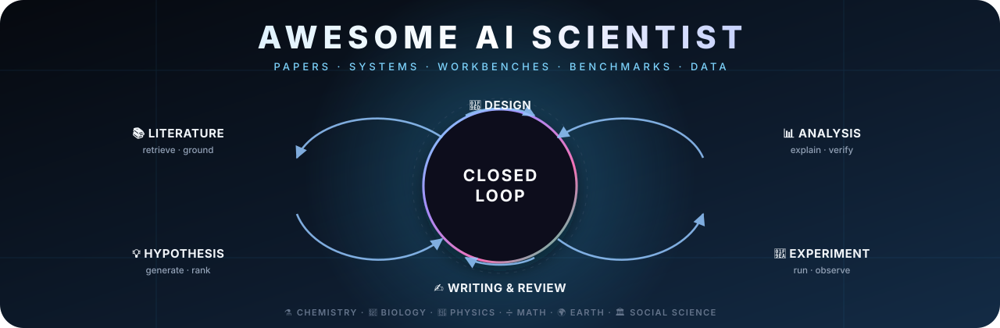

# 🧪 Awesome AI Scientist

**Papers, systems, benchmarks, datasets and open-source platforms for AI that does science.**

🔬 Systems · 🧰 Workbenches you can run · 📊 Benchmarks · 📦 Data & environments · 🎓 Learning resources

---

## 🔥 News

_Newest first. Watch the repo to get pinged when a batch lands._

🧰 **[2026-09] Open-Source Workbenches section.** Platforms you can actually clone and run now have their own home, starting with Open Science Desktop, the MIT-licensed local-first research workbench.

🤗 **[2026-09] Hugging Face Daily Papers links.** Every entry whose paper has a 🤗 Daily Papers page now carries a direct badge, so you can jump straight to the community discussion and upvotes.

🎨 **[2026-09] New look.** Redesigned hero, live badge wall, per-entry arXiv-ID badges, and a navigation layer built for scanning rather than reading.

🚀 **[2026-08] Repository launch.** First release covering AI Scientist systems, co-scientists, benchmarks, datasets, and scientific environments. See [CONTRIBUTING.md](CONTRIBUTING.md) for how to add yours.

💡 **[Ongoing] PRs welcome.** Missing something strong? Open a pull request. One excellent entry beats five weak ones.

---

## 📚 Contents

| | Section | |
|:--|:--|:--|
| 🧭 | [Surveys & Position Papers](#-surveys--position-papers) | the lay of the land |
| 🤖 | [End-to-End AI Scientists](#-end-to-end-ai-scientists) | full loop, idea to paper |
| 🔬 | [Co-Scientists & Research Agents](#-co-scientists--research-agents) | part of the loop, human in charge |
| 🧰 | [Open-Source Workbenches](#-open-source-workbenches) | clone it and run it today |
| 📊 | [Benchmarks & Evaluation](#-benchmarks--evaluation) | how we know it works |
| 📦 | [Datasets, Corpora & Environments](#-datasets-corpora--environments) | what agents feed on |
| 🎓 | [Tutorials, Blogs & Talks](#-tutorials-blogs--talks) | how to get started |
| 🔗 | [Related Awesome Lists](#-related-awesome-lists) | neighbours worth reading |
| 🤝 | [Contributing](#-contributing) · 🌟 [Star History](#-star-history) · 📌 [Citation](#-citation) · 📄 [License](#-license) | |

**Legend.** ⭐ editor's pick ·  preprint ·  repo with live star count ·  Hugging Face Daily Papers ·  project page

---

## 🧭 Surveys & Position Papers

- ⭐ **From AI for Science to Agentic Science** · Broad map of agentic discovery systems, workflows, tools, and the open problems that remain.  
- **Agentic AI for Scientific Discovery** · Survey of agents, scientific reasoning, tool use, and evaluation practice.  
- **From Automation to Autonomy** · Taxonomy of the transition from task automation to autonomous discovery with LLMs.  
- **Agent Systems for Academic Research Automation** · Survey of research agents across literature, ideation, experimentation, and paper production. 
- **Exploring the role of LLMs in the scientific method** · Perspective on where language models fit and where human judgment stays essential. 
- **Automated Scientific Discovery** · The longer arc from symbolic equation discovery to autonomous discovery systems. 

---

## 🤖 End-to-End AI Scientists

Systems that connect several research stages into one loop. Human supervision is still normal, and "autonomous" is not treated as a binary claim.

- ⭐ **OmniScientist** · Omni-modal, omni-discipline AI scientist that reasons over heterogeneous scientific evidence across modalities.    
- ⭐ **The AI Scientist** · Full machine-learning research pipeline spanning ideation, coding, experiments, analysis, writing, and automated review.     
- ⭐ **The AI Scientist-v2** · Drops human-authored templates and explores research directions by agentic tree search with visual feedback.    
- ⭐ **Robin** · Multi-agent biological discovery loop connecting hypothesis generation, experimental strategy, data analysis, and follow-up studies.   
- ⭐ **data-to-paper** · Auditable pipeline from dataset to paper that traces every quantitative claim back to executable code.   
- **Agent Laboratory** · Human-in-the-loop workflow taking a scientist's idea through literature review, experiments, and a report.    

---

## 🔬 Co-Scientists & Research Agents

Highly relevant to AI Scientist research, but focused on part of the loop or explicitly keeping the human scientist as decision maker.

- ⭐ **Towards an AI co-scientist** · Multi-agent system that generates, debates, ranks, and evolves hypotheses against a scientist's stated goal.   
- ⭐ **PaperQA2** · Evidence-grounded literature synthesis with retrieval, source attribution, and answer verification.    
- ⭐ **OpenScholar** · Open retrieval-augmented agent for citation-grounded synthesis over a large scholarly corpus.     
- ⭐ **Biomni** · General biomedical agent with retrieval, planning, code execution, and a broad tool and database ecosystem.   
- ⭐ **Coscientist** · LLM lab agent that planned and executed chemistry experiments through web, docs, code, and robotic-lab interfaces.  
- **ChemCrow** · Chemistry agent pairing an LLM with chemical tools for synthesis planning and experimental workflows.    
- **ResearchAgent** · Literature graph plus iterative review agents proposing research problems, methods, and experiment plans.  
- **Aviary** · Scientific gym environments and agent infrastructure for literature search, DNA cloning, and protein stability.    

---

## 🧰 Open-Source Workbenches

Platforms you can clone, install, and drive today. Real code and a real license, not a paper stub.

- ⭐ **Open Science Desktop** · Local-first, model-agnostic desktop workbench running the full loop from exploration to paper, with provenance for every artifact.    

> 🚧 More workbenches are being verified and land in the next batch.

---

## 📊 Benchmarks & Evaluation

Evaluation is the bottleneck. These test scientific knowledge, literature grounding, code and experiment execution, whole research workflows, or interaction with scientific environments.

- ⭐ **AstaBench** · Broad research suite spanning literature, ideation, coding, and analysis tasks.   
- ⭐ **ScienceBoard** · Realistic multi-domain research tasks across GUI and CLI environments.    
- ⭐ **ScienceAgentBench** · Expert-authored scientific coding tasks grounded in peer-reviewed papers.    
- ⭐ **PaperBench** · Reproducing and extending published research from paper specifications, code, and execution.    
- ⭐ **CORE-Bench** · Reproducibility tasks across computational social science, medicine, and related fields.    
- **SciCode** · Scientist-curated coding problems decomposed into executable subproblems.    
- **MLE-bench** · Execution-based evaluation on real-world machine-learning engineering tasks.   
- **LAB-Bench** · Biology research capabilities including protocols, sequence reasoning, and literature understanding.    
- **AIRS-Bench** · Frontier ML research tasks over a full research lifecycle, without assuming baseline code.    

---

## 📦 Datasets, Corpora & Environments

Corpora, tools, simulated worlds, and domain data that agents feed on. Scoped to scientific-agent use, not an exhaustive AI-for-Science catalog.

### Agent environments and research corpora

- **DiscoveryWorld** · Interactive simulated discovery tasks in text and 2D environments.  
- **ScienceWorld** · Interactive text science environment for embodied reasoning and experimentation.   
- **ScholarQABench** · Benchmark and data for scientific question answering over scholarly literature. 
- **HypoGen** · Structured scientific hypothesis data released with Sparks of Science. 
- **S2ORC** · Large open scientific paper corpus for scholarly NLP and retrieval. 
- **OpenAlex** · Open scholarly graph and API over works, authors, institutions, and concepts.  

### Scientific data and tools

- **Materials Project** · Computed materials properties, structures, and discovery infrastructure. 
- **ChEMBL** · Curated bioactivity database for drug-discovery research. 
- **PubChem** · Open chemical information and compound database. 
- **ProteinGym** · Protein fitness prediction datasets and evaluation resources. 

---

## 🎓 Tutorials, Blogs & Talks

- **Sakana AI, The AI Scientist** · Project overview and worked examples for the original system. 
- **FutureHouse tutorial series** · Practical material on building and using scientific agents. 
- **Google DeepMind, AlphaEvolve** · Algorithm discovery through an LLM-guided coding agent. 
- **Google Research, AI co-scientist** · Official overview of a multi-agent research partner. 

> 🚧 Courses, conference tutorials, and workshops land in the next batch.

---

## 🔗 Related Awesome Lists

- **awesome-agents4science** · Broader reading list for agents in scientific discovery. 
- **The Library of AI Scientist** · Larger collection of AI Scientist papers, projects, and resources. 
- **AI4Science reading list** · Wider AI-for-Science papers and tools beyond autonomous research agents. 

---

## 🤝 Contributing

Focused additions, corrections, and better primary links are all welcome. Read [CONTRIBUTING.md](CONTRIBUTING.md) first.

A strong entry has at least one of these.

- a peer-reviewed paper or a technically substantive preprint;
- a public implementation, benchmark, dataset, environment, or reproducible artifact;
- an evaluation measuring scientific validity, reproducibility, tool use, or research productivity;
- a clear tie to literature review, ideation, experiment design, experimentation, analysis, or writing.

Prefer one excellent entry over several weak ones. Generic chat wrappers, unsupported "AI Scientist" marketing, and papers with no scientific-agent relevance are out of scope.

Every link in this README is machine-checked. Run `python3 scripts/check_links.py README.md` before opening a PR.

---

## 🌟 Star History

## 🙏 Contributors

## 📌 Citation

~~~bibtex
@misc{awesome_ai_scientist,
  title        = {Awesome AI Scientist},
  year         = {2026},
  howpublished = {\url{https://github.com/Omni-Scientist/AI-Scientist-Awesome}},
  note         = {A curated list of AI systems, benchmarks, datasets and platforms for scientific discovery}
}
~~~

## 📄 License

Released under [CC BY 4.0](LICENSE). Linked papers, code, datasets, and websites stay under their own licenses.
