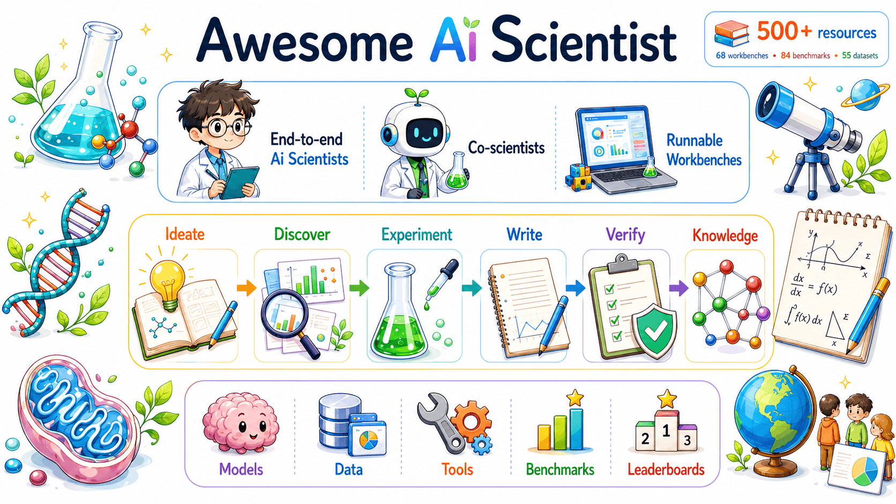

<div align="center">



# Awesome AI Scientist [](https://awesome.re)

> Papers, systems, benchmarks, datasets and leaderboards for AI that does science.

[](https://omni-scientist.github.io/)


🔬 Systems · 🧰 Workbenches you can run · 📊 Benchmarks · 📦 Data & environments · 🎓 Learning resources

</div>

---

## Contents

- [🔥 News](#-news)
- [🤖 End-to-End AI Scientists](#-end-to-end-ai-scientists) (35)
- [🔬 Co-Scientists & Research Agents](#-co-scientists--research-agents) (27)
- [🧰 Open-Source Workbenches](#-open-source-workbenches) (64)
- [🧭 Surveys & Position Papers](#-surveys--position-papers) (38)
- [🔭 Research Stages](#-research-stages) (72)
- [🌍 Domains](#-domains) (60)
- [🧠 Scientific Foundation Models](#-scientific-foundation-models) (14)
- [📊 Benchmarks & Evaluation](#-benchmarks--evaluation) (84)
- [🏆 Leaderboards & Live Trackers](#-leaderboards--live-trackers) (5)
- [📦 Datasets, Corpora & Environments](#-datasets-corpora--environments) (55)
- [🛡️ Safety, Ethics & Policy](#-safety-ethics--policy) (20)
- [🎓 Tutorials, Blogs & Talks](#-tutorials-blogs--talks) (19)
- [🔗 Related Awesome Lists](#-related-awesome-lists) (3)

---

## 🔥 News

🧰 **2026-09 · Open-Source Workbenches section.** Platforms you can actually clone and run now have their own home.

🤗 **2026-09 · Hugging Face Daily Papers links.** Every entry whose paper has a 🤗 Daily Papers page now carries a direct badge, so you can jump straight to the community discussion and upvotes.

🚀 **2026-08 · Repository launch.** First release covering AI Scientist systems, co-scientists, benchmarks, datasets, and scientific environments.

💡 **Ongoing · PRs welcome.** Missing something strong? Open a pull request. One excellent entry beats five weak ones.

---

## 🤖 End-to-End AI Scientists

Systems that connect several research stages into one loop. Human supervision is still normal, and "autonomous" is not treated as a binary claim.

- ⭐ [OmniScientist](https://arxiv.org/abs/2608.13558) - Omni-modal, omni-discipline AI scientist that reasons over heterogeneous scientific evidence across modalities.  [](https://github.com/Omni-Scientist/OmniScientist) [](https://huggingface.co/papers/2608.13558) [](https://omni-scientist.github.io/)
- ⭐ [The AI Scientist](https://arxiv.org/abs/2408.06292) - Full machine-learning research pipeline spanning ideation, coding, experiments, analysis, writing, and automated review. [](https://www.nature.com/articles/s41586-026-10265-5)  [](https://github.com/SakanaAI/AI-Scientist) [](https://huggingface.co/papers/2408.06292) [](https://sakana.ai/ai-scientist/)
- ⭐ [The AI Scientist-v2](https://arxiv.org/abs/2504.08066) - Drops human-authored templates and explores research directions by agentic tree search with visual feedback.  [](https://github.com/SakanaAI/AI-Scientist-v2) [](https://huggingface.co/papers/2504.08066) [](https://pub.sakana.ai/ai-scientist-v2/paper/paper.pdf)
- ⭐ [Robin](https://www.nature.com/articles/s41586-026-10652-y) - Multi-agent biological discovery loop connecting hypothesis generation, experimental strategy, data analysis, and follow-up studies.  [](https://github.com/Future-House/robin) [](https://www.futurehouse.org/research/demonstrating-end-to-end-scientific-discovery-with-robin-a-multi-agent-system)
- ⭐ [data-to-paper](https://arxiv.org/abs/2404.17605) - Auditable pipeline from dataset to paper that traces every quantitative claim back to executable code. [](https://doi.org/10.1056/AIoa2400555)  [](https://github.com/Technion-Kishony-lab/data-to-paper)
- [Agent Laboratory](https://arxiv.org/abs/2501.04227) - Human-in-the-loop workflow taking a scientist's idea through literature review, experiments, and a report.  [](https://github.com/SamuelSchmidgall/AgentLaboratory) [](https://huggingface.co/papers/2501.04227) [](https://agentlaboratory.github.io/)
- [AutoResearchClaw](https://arxiv.org/abs/2605.20025) - Multi-agent debate for hypothesis generation and analysis, failure-recovering execution, and experience carried across research cycles.  [](https://github.com/aiming-lab/AutoResearchClaw) [](https://huggingface.co/papers/2605.20025)
- [EvoScientist](https://arxiv.org/abs/2603.08127) - Evolving multi-agent AI scientist that adapts its pipeline from accumulated interaction history rather than a fixed workflow.  [](https://github.com/EvoScientist/EvoScientist) [](https://huggingface.co/papers/2603.08127) [](https://EvoScientist.ai/)
- [DeepScientist](https://arxiv.org/abs/2509.26603) - Formalizes discovery as Bayesian optimization over a hypothesize-verify-analyze hierarchy with cumulative findings memory, across month-long runs.  [](https://github.com/ResearAI/DeepScientist) [](https://huggingface.co/papers/2509.26603) [](https://deepscientist.cc/)
- [Kosmos](https://arxiv.org/abs/2511.02824) - Runs twelve-hour-plus cycles over a shared world model, coordinating parallel literature-search and data-analysis agents into cited findings.  [](https://github.com/EdisonScientific/kosmos-figures) [](https://huggingface.co/papers/2511.02824) [](https://edisonscientific.com/)
- [Denario](https://arxiv.org/abs/2510.26887) - Modular multi-agent system that ideates, reviews literature, plans, writes and runs analysis code, and drafts full papers.  [](https://github.com/AstroPilot-AI/Denario) [](https://huggingface.co/papers/2510.26887) [](https://denario.readthedocs.io/en/latest/)
- [CycleResearcher](https://arxiv.org/abs/2411.00816) - Trains an open research LLM with reinforcement learning from an automated reviewer model, closing a research-and-review loop.   [](https://github.com/zhu-minjun/Researcher) [](https://huggingface.co/papers/2411.00816) [](https://wengsyx.github.io/Researcher/)
- [Dolphin](https://arxiv.org/abs/2501.03916) - Generates ideas, auto-debugs and runs experiments, then feeds analyzed results back into the next idea-generation round.   [](https://github.com/InternScience/Dolphin) [](https://huggingface.co/papers/2501.03916) [](https://alpha-innovator.github.io/Dolphin-project-page)
- [CORAL](https://arxiv.org/abs/2604.01658) - Long-running coding agents explore and collaborate via shared persistent memory, asynchronous execution and heartbeat interventions.   [](https://github.com/Human-Agent-Society/CORAL) [](https://huggingface.co/papers/2604.01658) [](https://coral.compounding-intelligence.ai)
- [ASI-Evolve](https://arxiv.org/abs/2603.29640) - Agentic learn-design-experiment-analyze loop for AI-for-AI research, adding a human-prior cognition base and dedicated result analyzer.  [](https://github.com/GAIR-NLP/ASI-Evolve) [](https://huggingface.co/papers/2603.29640)
- [Darwin Godel Machine](https://arxiv.org/abs/2505.22954) - Coding agent that rewrites its own source, keeping an archive of variants validated empirically on SWE-bench and Polyglot.   [](https://github.com/jennyzzt/dgm) [](https://huggingface.co/papers/2505.22954) [](https://sakana.ai/dgm/)
- [AlphaEvolve](https://arxiv.org/abs/2506.13131) - LLM-driven evolutionary loop mutating program code against automated evaluators, discovering 48-multiplication 4x4 complex matrix multiplication.  [](https://github.com/google-deepmind/alphaevolve_results) [](https://huggingface.co/papers/2506.13131) [](https://deepmind.google/blog/alphaevolve-a-gemini-powered-coding-agent-for-designing-advanced-algorithms/)
- [FunSearch](https://doi.org/10.1038/s41586-023-06924-6) - Pairs a pretrained LLM with an automated evaluator in an evolutionary program loop, producing a new largest cap set.   [](https://github.com/google-deepmind/funsearch)
- [ShinkaEvolve](https://arxiv.org/abs/2509.19349) - Sample-efficient LLM program evolution using adaptive parent sampling, novelty-based rejection and bandit-based model selection.   [](https://github.com/SakanaAI/ShinkaEvolve) [](https://huggingface.co/papers/2509.19349) [](https://sakanaai.github.io/ShinkaEvolve/)
- [MLE-STAR](https://arxiv.org/abs/2506.15692) - Web-searches for candidate models, then performs ablation-guided iterative refinement of one targeted code block at a time.   [](https://huggingface.co/papers/2506.15692) [](https://cloud.google.com/blog/products/ai-machine-learning/mle-star-machine-learning-engineering-agent)
- [ML-Master 2.0](https://arxiv.org/abs/2601.10402) - Sustains ultra-long-horizon engineering runs via hierarchical cognitive caching that distills execution traces into reusable long-term knowledge.  [](https://github.com/sjtu-sai-agents/ML-Master) [](https://huggingface.co/papers/2601.10402) [](https://sjtu-sai-agents.github.io/ML-Master/)
- [Kolb-Based Experiential Learning (Agent K)](https://arxiv.org/abs/2411.03562) - Automates the full Kaggle lifecycle by learning from experience through nested structured memory, without fine-tuning or backpropagation.  [](https://huggingface.co/papers/2411.03562)
- [AutoKaggle](https://arxiv.org/abs/2410.20424) - Phase-based multi-agent workflow for tabular Kaggle tasks with iterative debugging, unit testing and a shared tools library.  [](https://github.com/multimodal-art-projection/AutoKaggle) [](https://huggingface.co/papers/2410.20424)
- [DS-Agent](https://arxiv.org/abs/2402.17453) - Retrieves and adapts human Kaggle expert cases via case-based reasoning, with a cheaper low-resource deployment mode.   [](https://github.com/guosyjlu/DS-Agent)
- [AutoML-Agent](https://arxiv.org/abs/2410.02958) - Converts natural-language task descriptions into deployable models via retrieval-augmented planning and parallel multi-agent execution with verification.   [](https://github.com/DeepAuto-AI/automl-agent) [](https://huggingface.co/papers/2410.02958) [](https://deepauto-ai.github.io/automl-agent/)
- [MLR-Copilot](https://arxiv.org/abs/2408.14033) - Takes a paper, generates hypotheses and experiment plans, retrieves prototype code and models, then executes experiments with human feedback.  [](https://github.com/du-nlp-lab/MLR-Copilot) [](https://huggingface.co/papers/2408.14033) [](https://huggingface.co/spaces/du-lab/MLR-Copilot)
- [AI-Newton](https://arxiv.org/abs/2504.01538) - Autonomously invents interpretable physical concepts and generalizes symbolic laws from raw mechanics data without prior physical knowledge.  [](https://github.com/Science-Discovery/AI-Newton)
- [AtomAgents](https://arxiv.org/abs/2407.10022) - Agent team runs molecular dynamics simulations and surrogate models to autonomously design and screen metallic alloys.   [](https://github.com/lamm-mit/AtomAgents)
- [MatAgent](https://arxiv.org/abs/2504.00741) - Couples diffusion-based crystal generation, property predictors and an LLM reasoning loop to hit target inorganic material properties.  [](https://github.com/izumitkhr/matagent)
- [El Agente](https://arxiv.org/abs/2505.02484) - Hierarchical LLM agents plan, launch and debug DFT and quantum-chemistry calculations from natural language on real HPC.  
- [LabOS](https://arxiv.org/abs/2510.14861) - Couples multimodal perception of physical lab actions with self-evolving agents and XR guidance for human-AI wet-lab collaboration.  [](https://github.com/zaixizhang/LabOS) [](https://ai4labos.com/)
- [ORGANA](https://arxiv.org/abs/2401.06949) - LLM planner converts natural-language chemistry goals into robot task-and-motion plans, then executes and characterizes wet-lab experiments.   [](https://github.com/ac-rad/organa) [](https://ac-rad.github.io/organa/)
- [ProtAgents](https://arxiv.org/abs/2402.04268) - Agents combine physics simulation and generative protein models to design and evaluate proteins with target mechanical properties.   [](https://github.com/lamm-mit/ProtAgents) [](https://huggingface.co/papers/2402.04268)
- [STELLA](https://arxiv.org/abs/2507.02004) - Multi-agent biomedical system that grows its own reasoning-template library and auto-discovers new bioinformatics tools into an expanding tool ocean.  [](https://github.com/zaixizhang/STELLA) [](https://huggingface.co/papers/2507.02004)
- [CRISPR-GPT](https://arxiv.org/abs/2404.18021) - Guides CRISPR knockout, base and prime editing design, sgRNA selection, off-target analysis and validation planning.   [](https://github.com/cong-lab/crispr-gpt-pub) [](https://huggingface.co/papers/2404.18021) [](https://genomics.stanford.edu)

---

## 🔬 Co-Scientists & Research Agents

Highly relevant to AI Scientist research, but focused on part of the loop or explicitly keeping the human scientist as decision maker.

- ⭐ [Co-Scientist](https://arxiv.org/abs/2502.18864) - Multi-agent system that generates, debates, ranks, and evolves hypotheses against a scientist's stated goal. [](https://doi.org/10.1038/s41586-026-10644-y)  [](https://huggingface.co/papers/2502.18864) [](https://research.google/blog/accelerating-scientific-breakthroughs-with-an-ai-co-scientist/)
- ⭐ [PaperQA2](https://arxiv.org/abs/2409.13740) - Evidence-grounded literature synthesis with retrieval, source attribution, and answer verification.  [](https://github.com/Future-House/paper-qa) [](https://huggingface.co/papers/2409.13740) [](https://www.futurehouse.org/research/engineering-blog-journey-to-superhuman-performance-on-scientific-tasks)
- ⭐ [OpenScholar](https://arxiv.org/abs/2411.14199) - Open retrieval-augmented agent for citation-grounded synthesis over a large scholarly corpus. [](https://www.nature.com/articles/s41586-025-10072-4)  [](https://github.com/AkariAsai/OpenScholar) [](https://huggingface.co/papers/2411.14199) [](https://open-scholar.allen.ai/)
- ⭐ [Biomni](https://doi.org/10.1101/2025.05.30.656746) - General biomedical agent with retrieval, planning, code execution, and a broad tool and database ecosystem.  [](https://github.com/snap-stanford/Biomni) [](https://biomni.stanford.edu/)
- ⭐ [Coscientist](https://www.nature.com/articles/s41586-023-06792-0) - LLM lab agent that planned and executed chemistry experiments through web, docs, code, and robotic-lab interfaces.  [](https://github.com/gomesgroup/coscientist)
- [ChemCrow](https://arxiv.org/abs/2304.05376) - Chemistry agent pairing an LLM with chemical tools for synthesis planning and experimental workflows. [](https://doi.org/10.1038/s42256-024-00832-8)  [](https://github.com/ur-whitelab/chemcrow-public) [](https://huggingface.co/papers/2304.05376)
- [ResearchAgent](https://arxiv.org/abs/2404.07738) - Literature graph plus iterative review agents proposing research problems, methods, and experiment plans.  [](https://huggingface.co/papers/2404.07738)
- [Aviary](https://arxiv.org/abs/2412.21154) - Scientific gym environments and agent infrastructure for literature search, DNA cloning, and protein stability.  [](https://github.com/Future-House/aviary) [](https://github.com/Future-House/ldp) [](https://huggingface.co/papers/2412.21154)
- [SciAgents](https://arxiv.org/abs/2409.05556) - Traverses a large ontological materials knowledge graph with specialized agents to generate, critique and expand novel research hypotheses.   [](https://github.com/lamm-mit/SciAgentsDiscovery) [](https://huggingface.co/papers/2409.05556)
- [ToolUniverse](https://arxiv.org/abs/2509.23426) - Standardizes over 600 scientific tools and databases behind one MCP-compatible interface any LLM agent can call.  [](https://github.com/mims-harvard/ToolUniverse) [](https://huggingface.co/papers/2509.23426) [](https://aiscientist.tools)
- [CoI-Agent (Chain of Ideas)](https://arxiv.org/abs/2410.13185) - Organizes prior literature into a progressive chain mirroring a field's development, then generates and ranks novel research ideas.  [](https://github.com/DAMO-NLP-SG/CoI-Agent) [](https://huggingface.co/papers/2410.13185)
- [SciMaster / X-Master](https://arxiv.org/abs/2507.05241) - Tool-augmented reasoning agent emitting Python as its interaction language, scoring 32.1% on Humanity's Last Exam.  [](https://github.com/sjtu-sai-agents/X-Master) [](https://huggingface.co/papers/2507.05241)
- [BioDiscoveryAgent](https://arxiv.org/abs/2405.17631) - Iteratively selects CRISPR gene-perturbation batches using literature review, gene-similarity search and Reactome, replacing Bayesian active learning.  [](https://github.com/snap-stanford/BioDiscoveryAgent) [](https://huggingface.co/papers/2405.17631)
- [GeneAgent](https://arxiv.org/abs/2405.16205) - Generates gene-set names and narratives, then self-verifies each claim against biological domain databases before reporting.   [](https://github.com/ncbi-nlp/GeneAgent) [](https://huggingface.co/papers/2405.16205)
- [TAIS](https://arxiv.org/abs/2402.12391) - Role-playing agent team including project manager, data engineer, statistician and critic identifying disease-predictive genes from expression data.  [](https://github.com/Liu-Hy/GenoMAS) [](https://huggingface.co/papers/2402.12391) [](https://liu-hy.github.io/GenoMAS/)
- [GenoMAS](https://arxiv.org/abs/2507.21035) - Code-driven multi-agent framework automating gene-expression analysis through generated, executed and revised programs.  [](https://github.com/Liu-Hy/GenoMAS) [](https://huggingface.co/papers/2507.21035)
- [dZiner](https://arxiv.org/abs/2410.03963) - Iteratively edits candidate molecules using literature-mined design rules and surrogate property oracles under human-readable constraints.  [](https://github.com/mehradans92/dZiner) [](https://mehradans92.github.io/dZiner/)
- [ChemAgent](https://arxiv.org/abs/2501.06590) - Decomposes chemistry problems into a dynamically updated sub-task memory library retrieved and refined at inference.   [](https://github.com/gersteinlab/ChemAgent) [](https://huggingface.co/papers/2501.06590)
- [LLMatDesign](https://arxiv.org/abs/2406.13163) - LLM proposes composition modifications, scores them with ML property predictors and self-reflects across iterations toward target properties.  [](https://github.com/Fung-Lab/LLMatDesign)
- [BioResearcher](https://github.com/XMUDM/BioResearcher) - Multi-agent pipeline searches literature and datasets, then drafts and reviews dry and wet-lab biomedical experimental protocols.  
- [AstroAgents](https://arxiv.org/abs/2503.23170) - Eight collaborating agents analyze meteorite and soil mass-spectrometry data with literature context to generate astrobiology hypotheses.   [](https://github.com/amirgroup-codes/AstroAgents) [](https://astroagents.github.io/)
- [The AI Cosmologist](https://arxiv.org/abs/2504.03424) - Agentic pipeline that plans, codes, executes and interprets cosmological data analyses end to end.  [](https://github.com/adammoss/aicosmologist) [](https://huggingface.co/papers/2504.03424)
- [Nova](https://arxiv.org/abs/2410.14255) - Iteratively plans and searches external literature to expand the idea pool, targeting novelty and diversity over single-shot generation.  [](https://huggingface.co/papers/2410.14255)
- [SciSciGPT](https://arxiv.org/abs/2504.05559) - Specialist agents for literature search, database querying, analytics and evaluation over science-of-science data.  [](https://github.com/Northwestern-CSSI/SciSciGPT)
- [SciAgent](https://arxiv.org/abs/2402.11451) - Tool-augmented language models for scientific reasoning, retrieving and composing domain tools to solve science problems.  [](https://huggingface.co/papers/2402.11451)
- [Elicit](https://elicit.com/) - Screens and extracts structured data from 125M papers, automating systematic-review screening into reusable tables. 
- [Undermind](https://www.undermind.ai/whitepaper.pdf) - Iteratively reads and scores hundreds of papers and follows citation trails until a search is exhaustive.   [](https://www.undermind.ai/)

---

## 🧰 Open-Source Workbenches

Platforms you can clone, install, and drive today.

### 🖥️ End-to-end research platforms

- ⭐ [OmniScientist](https://github.com/Omni-Scientist/OmniScientist) - Omni-modal, omni-discipline AI scientist you can run locally across heterogeneous scientific evidence.  [](https://github.com/Omni-Scientist/OmniScientist) [](https://huggingface.co/papers/2608.13558) [](https://omni-scientist.github.io/)
- ⭐ [Open Science Desktop](https://github.com/ai4s-research/open-science) - Local-first desktop workbench wiring agents, notebooks, runs, figures and review into one auditable provenance trail.  [](https://openedscience.com/)
- ⭐ [InternAgent](https://arxiv.org/abs/2505.16938) - Closed loop from hypothesis through experiment to verification, evaluated across twelve scientific tasks. [](https://github.com/InternScience/InternAgent)  [](https://huggingface.co/papers/2505.16938) [](https://alpha-innovator.github.io/InternAgent-project-page)
- ⭐ [RD-Agent](https://arxiv.org/abs/2505.14738) - Automates the industrial R&D loop of hypothesis, implementation, evaluation and feedback on quant and Kaggle tasks. [](https://github.com/microsoft/RD-Agent)  [](https://huggingface.co/papers/2505.14738) [](https://rdagent.readthedocs.io/en/latest/)
- [freephdlabor](https://arxiv.org/abs/2510.15624) - Persistent multi-agent research group you point at your own problem, with human interruption and steering points. [](https://github.com/ltjed/freephdlabor)  [](https://huggingface.co/papers/2510.15624) [](https://freephdlabor.github.io/)
- [The Virtual Lab](https://doi.org/10.1038/s41586-025-09442-9) - PI agent convening specialist agents in structured meetings; the design produced validated SARS-CoV-2 nanobodies. [](https://github.com/zou-group/virtual-lab) 
- [Curie](https://arxiv.org/abs/2502.16069) - Runs controlled, reproducible ML and systems experiments with rigor constraints imposed on the agent's method. [](https://github.com/Just-Curieous/Curie)  [](https://huggingface.co/papers/2502.16069) [](https://www.just-curieous.com/)
- [TxAgent](https://arxiv.org/abs/2503.10970) - Therapeutic reasoning and drug-interaction analysis across a universe of 211 biomedical tools. [](https://github.com/mims-harvard/TxAgent)  [](https://huggingface.co/papers/2503.10970) [](https://zitniklab.hms.harvard.edu/TxAgent/)
- [Galaxy](https://doi.org/10.1093/nar/gkag469) - Self-hostable web platform for building, running and sharing reproducible data-intensive science workflows. [](https://github.com/galaxyproject/galaxy)  [](https://galaxyproject.org/)
- [MLE-Agent](https://github.com/MLSysOps/MLE-agent) - Plans and implements ML engineering work with arXiv integration and code retrieval. 

### 📖 Literature and deep-research platforms

- ⭐ [STORM and Co-STORM](https://arxiv.org/abs/2402.14207) - Generates a full-length cited report from a topic, with a human-in-the-loop collaborative discourse mode. [](https://github.com/stanford-oval/storm)  [](https://huggingface.co/papers/2402.14207) [](https://storm.genie.stanford.edu)
- ⭐ [Asta](https://allenai.org/asta) - AI2's science agent family, reproducible and benchmarkable against a rigorous multi-task research suite. [](https://github.com/allenai/asta-paper-finder) [](https://github.com/allenai/asta-bench)  [](https://allenai.org/asta)
- [GPT Researcher](https://github.com/assafelovic/gpt-researcher) - Autonomous deep research over web and local documents with any provider, emitting a cited report.  [](https://gptr.dev)
- [DeerFlow](https://github.com/bytedance/deer-flow) - Long-horizon agent harness that researches, writes code, and produces artifacts.  [](https://deerflow.tech)
- [Local Deep Research](https://github.com/LearningCircuit/local-deep-research) - Fully local, encrypted research agent over arXiv, PubMed, and your own private document collection. 
- [OpenResearcher](https://arxiv.org/abs/2408.06941) - Retrieval-augmented question answering over arXiv with query rewriting and iterative refinement. [](https://github.com/GAIR-NLP/OpenResearcher)  [](https://huggingface.co/papers/2408.06941)
- [DeepResearchAgent](https://github.com/SkyworkAI/DeepResearchAgent) - Hierarchical planner plus specialist agents for deep research and general task execution. 
- [DeepLiterature](https://github.com/ScienceOne-AI/DeepLiterature) - Open research assistant combining search, code execution, link resolution and information expansion. 
- [Deep Research from Scratch](https://github.com/langchain-ai/deep_research_from_scratch) - LangGraph reference implementation of a deep-research agent, the maintained successor to Open Deep Research. 

### 🔬 Lab automation and self-driving labs

- [Opentrons](https://github.com/Opentrons/opentrons) - Write Python protocols and execute them on physical Flex and OT-2 liquid-handling robots.  [](https://docs.opentrons.com/)
- [PyLabRobot](https://doi.org/10.1016/j.device.2023.100111) - One hardware-agnostic Python interface driving liquid handlers, plate readers, centrifuges and thermocyclers. [](https://github.com/PyLabRobot/pylabrobot)  [](https://docs.pylabrobot.org)
- [Bluesky](https://github.com/bluesky/bluesky) - Orchestrates beamline and laboratory experiments plus data acquisition, in production at NSLS-II.  [](https://blueskyproject.io/bluesky)
- [Atlas](https://doi.org/10.1039/d4dd00115j) - Bayesian optimization acting as the decision-making brain of a self-driving laboratory. [](https://github.com/the-matter-lab/atlas)  [](https://matter-atlas.readthedocs.io/en/latest/)
- [Olympus](https://arxiv.org/abs/2010.04153) - Benchmarks experiment-planning and optimization algorithms against realistic, noisy emulated experimental surfaces. [](https://github.com/the-matter-lab/olympus)  [](https://the-matter-lab.github.io/olympus/)
- [Self-Driving Lab Demo](https://github.com/sparks-baird/self-driving-lab-demo) - Build and run a real low-cost autonomous experimentation rig from dimmable LEDs and a spectrophotometer.  [](https://self-driving-lab-demo.readthedocs.io/)

### 🧩 Libraries, skill packs and components

- ⭐ [Scientific Agent Skills](https://github.com/K-Dense-AI/scientific-agent-skills) - 165 validated science skills plus database connectors, installable into Claude Code, Cursor or Codex.  [](https://k-dense.ai)
- [AI4S Skills](https://github.com/ai4s-research/ai4s-skills) - Agent skills for topic exploration, literature survey, experiments, paper writing and integrity audit. 
- [AIDE](https://arxiv.org/abs/2502.13138) - Tree-search-driven ML engineering agent, the reference agent OpenAI ran on MLE-bench. [](https://github.com/WecoAI/aideml)  [](https://huggingface.co/papers/2502.13138) [](https://weco.ai)
- [TinyScientist](https://arxiv.org/abs/2510.06579) - Minimal, hackable think-code-write-review research agent, useful as a teaching or extension base. [](https://github.com/ulab-uiuc/tiny-scientist)  [](https://huggingface.co/papers/2510.06579)
- [ResearchTown](https://arxiv.org/abs/2412.17767) - Simulates a research community as an agent-data graph to study idea generation and propagation. [](https://github.com/ulab-uiuc/research-town)  [](https://huggingface.co/papers/2412.17767)
- [Virtual Scientists](https://github.com/InternScience/Virtual-Scientists) - Multi-agent simulation of science-of-science dynamics over real publication data. 
- [Intern-S1](https://arxiv.org/abs/2508.15763) - Self-hostable open scientific multimodal foundation model covering molecules, charts and reasoning. [](https://github.com/InternLM/Intern-S1)  [](https://huggingface.co/papers/2508.15763)
- [Data Formulator](https://doi.org/10.1145/3706598.3713296) - Author visualizations by describing concepts and letting the agent reshape the underlying data. [](https://github.com/microsoft/data-formulator)  [](https://data-formulator.ai)
- [OpenChemIE](https://doi.org/10.1021/acs.jcim.4c00572) - Extracts reactions and molecules from chemistry papers jointly across text, tables and figures. [](https://github.com/CrystalEye42/OpenChemIE) 
- [MolScribe](https://doi.org/10.1021/acs.jcim.2c01480) - Converts a molecule image into a structure graph with atom-level and bond-level confidence. [](https://github.com/thomas0809/MolScribe) 

### 🧱 General agent frameworks these are built on

- [MetaGPT and Data Interpreter](https://arxiv.org/abs/2402.18679) - SOP-structured agent roles; the Data Interpreter module runs end-to-end data science tasks. [](https://github.com/FoundationAgents/MetaGPT)  [](https://huggingface.co/papers/2402.18679)
- [CAMEL](https://arxiv.org/abs/2303.17760) - Role-playing multi-agent societies with configurable communication protocols and task decomposition. [](https://github.com/camel-ai/camel)  [](https://huggingface.co/papers/2303.17760)
- [OWL](https://arxiv.org/abs/2505.23885) - Optimized multi-agent workforces for task automation, topping open-source results on GAIA. [](https://github.com/camel-ai/owl)  [](https://huggingface.co/papers/2505.23885)
- [ChatDev](https://arxiv.org/abs/2307.07924) - Virtual multi-agent software company running design, coding, testing and documentation phases. [](https://github.com/OpenBMB/ChatDev)  [](https://huggingface.co/papers/2307.07924)
- [smolagents](https://github.com/huggingface/smolagents) - Minimal library for code-writing agents, shipping the reference Open Deep Research implementation.  [](https://huggingface.co/docs/smolagents)

### 🔧 More runnable systems

- [autoresearch (karpathy)](https://github.com/karpathy/autoresearch) - Gives an agent a real single-GPU nanochat training setup and lets it modify code, train, evaluate, keep or discard. 
- [ARIS (Auto-Research-In-Sleep)](https://github.com/wanshuiyin/Auto-claude-code-research-in-sleep) - Markdown-only skill pack for autonomous ML research providing cross-model review loops, idea discovery and experiment automation. 
- [Paper2Agent](https://arxiv.org/abs/2509.06917) - Automatically converts a paper and its codebase into an MCP-server agent that reproduces the paper's analyses on new inputs.  [](https://github.com/jmiao24/Paper2Agent) [](https://huggingface.co/papers/2509.06917)
- [Paper2Code](https://arxiv.org/abs/2504.17192) - Three-stage multi-agent pipeline of planning, analysis and generation that produces a runnable repository from a machine learning paper.   [](https://github.com/going-doer/Paper2Code) [](https://huggingface.co/papers/2504.17192)
- [claude-scholar](https://github.com/Galaxy-Dawn/claude-scholar) - Semi-automated research assistant spanning ideation, coding, experiments, writing and publication across Claude Code, Codex, Kimi and OpenCode. 
- [Dr. Claw](https://github.com/OpenLAIR/dr-claw) - Full-stack research workspace covering literature review, experiment management and paper writing on top of coding agents.  [](https://openlair.github.io/dr-claw/)
- [ScienceClaw](https://github.com/beita6969/ScienceClaw) - Self-evolving research colleague with 285 skills across 28 disciplines and persistent memory over literature and databases.  [](http://scienceclaw.science)
- [MLGym](https://arxiv.org/abs/2502.14499) - First Gym environment for AI research tasks, plus a 13-task open-ended benchmark enabling RL training of research agents.  [](https://github.com/facebookresearch/MLGym) [](https://huggingface.co/papers/2502.14499)
- [AIRA / aira-dojo](https://arxiv.org/abs/2507.02554) - Formalizes engineering agents as search policies over candidate solutions with pluggable greedy, MCTS and evolutionary scaffolds.   [](https://github.com/facebookresearch/aira-dojo) [](https://huggingface.co/papers/2507.02554)
- [DeepReview / DeepReviewer](https://arxiv.org/abs/2503.08569) - Structures LLM paper review as a human-like deep-thinking loop over novelty verification, multi-dimensional evaluation and reliability checks.   [](https://github.com/ResearAI/DeepReviewer-v2) [](https://huggingface.co/papers/2503.08569) [](https://deepscientist.cc/)
- [CMBAgent](https://arxiv.org/abs/2507.07257) - Planning-and-control multi-agent system where agents plan, write and execute Python and iterate on cosmology analysis pipelines.   [](https://github.com/CMBAgents/cmbagent) [](https://huggingface.co/papers/2507.07257) [](https://cmbagent.readthedocs.io/en/latest/)
- [LLM-SR](https://arxiv.org/abs/2404.18400) - Treats equations as Python programs, combining LLM scientific priors with evolutionary search and data-driven parameter fitting.   [](https://github.com/deep-symbolic-mathematics/LLM-SR) [](https://huggingface.co/papers/2404.18400)
- [AI Hilbert](https://doi.org/10.1038/s41467-024-50074-w) - Derives candidate scientific laws as polynomials jointly consistent with axioms and noisy data via sum-of-squares optimization.   [](https://github.com/IBM/AI-Hilbert) [](https://ai-hilbert.github.io/)
- [PaSa](https://arxiv.org/abs/2501.10120) - Autonomously invokes search tools, reads papers and follows references to satisfy complex scholarly queries, trained with reinforcement learning.  [](https://github.com/bytedance/pasa) [](https://huggingface.co/papers/2501.10120)
- [AutoSurvey](https://arxiv.org/abs/2406.10252) - Parallel outline-then-section generation with retrieval and iterative refinement to produce full literature surveys at scale.   [](https://github.com/AutoSurveys/AutoSurvey) [](https://huggingface.co/papers/2406.10252)
- [AutoSota](https://github.com/tsinghua-fib-lab/AutoSOTA) - CLI and leaderboard that autonomously optimizes existing research codebases, publishing results only when an internal ledger confirms improvement.  [](https://tsinghua-fib-lab.github.io/AutoSOTA/)
- [ChemGraph](https://arxiv.org/abs/2506.06363) - LangGraph agents orchestrate ASE, xTB, DFT and machine-learning potentials into reproducible molecular simulation workflows.   [](https://github.com/argonne-lcf/ChemGraph) [](https://argonne-lcf.github.io/ChemGraph/)
- [MDCrow](https://arxiv.org/abs/2502.09565) - Chains around 40 tools to set up, run and analyze OpenMM molecular dynamics simulations from a natural-language prompt.   [](https://github.com/ur-whitelab/MDCrow)
- [LLaMP](https://arxiv.org/abs/2401.17244) - Hierarchical ReAct agents query Materials Project APIs and run atomistic simulations to ground materials answers and cut hallucination.   [](https://github.com/chiang-yuan/llamp) [](https://huggingface.co/papers/2401.17244)
- [HoneyComb](https://arxiv.org/abs/2409.00135) - Pairs a curated materials knowledge base with a tool hub and retriever to answer computational materials science tasks.   [](https://github.com/BangLab-UdeM-Mila/NLP4MatSci-HoneyComb)
- [CellAgent](https://arxiv.org/abs/2407.09811) - Planner, executor and evaluator agents decompose and self-correct single-cell RNA-seq analysis pipelines from a natural-language task.  [](https://github.com/liu-shiqiang/CellAgent) [](https://huggingface.co/papers/2407.09811)
- [ResearchCodeAgent](https://arxiv.org/abs/2504.20117) - Multi-agent system that codifies a research methodology description into runnable experiment code with dynamic planning.   [](https://huggingface.co/papers/2504.20117)
- [EvoMaster](https://github.com/sjtu-sai-agents/EvoMaster) - Foundational evolving-agent framework reimplementing the SciMaster line including ML-Master, X-Master and Browse-Master. 
- [LabClaw](https://github.com/wu-yc/LabClaw) - Skills-only operating layer for LabOS, with no engine of its own.  [](https://labclaw-ai.github.io/)

### ⚠️ License traps worth knowing

**AI-Researcher** (`HKUDS/AI-Researcher`, 5.7k stars) ships substantial code but has **no license file at all**, so all rights are reserved.
**Coscientist** (`gomesgroup/coscientist`) carries a **Commons Clause** rider forbidding sale, which is not OSI open source.
**The AI Scientist** and **v2** use a custom AI Scientist Source Code License derived from the Responsible AI license, carrying use restrictions.
**UniScientist** (`UniPat-AI/UniScientist`) has no license file.

## 🧭 Surveys & Position Papers

- ⭐ [From AI for Science to Agentic Science](https://arxiv.org/abs/2508.14111) - Broad map of agentic discovery systems, workflows, tools, and the open problems that remain.  [](https://huggingface.co/papers/2508.14111)
- [Agentic AI for Scientific Discovery](https://arxiv.org/abs/2503.08979) - Survey of agents, scientific reasoning, tool use, and evaluation practice.  [](https://huggingface.co/papers/2503.08979)
- [From Automation to Autonomy](https://arxiv.org/abs/2505.13259) - Taxonomy of the transition from task automation to autonomous discovery with LLMs.  [](https://huggingface.co/papers/2505.13259)
- [Agent Systems for Academic Research Automation](https://openreview.net/forum?id=iAfYyiCzev) - Survey of research agents across literature, ideation, experimentation, and paper production. 
- [Exploring the role of LLMs in the scientific method](https://doi.org/10.1038/s44387-025-00019-5) - Perspective on where language models fit and where human judgment stays essential. 
- [Automated Scientific Discovery](https://link.springer.com/article/10.1007/s10994-025-06955-2) - The longer arc from symbolic equation discovery to autonomous discovery systems. 
- [AI4Research](https://arxiv.org/abs/2507.01903) - Taxonomy of AI across scientific comprehension, surveying, discovery, writing and peer review, with resources and open problems.  [](https://huggingface.co/papers/2507.01903)
- [LLM4SR](https://arxiv.org/abs/2501.04306) - Organizes LLM roles into hypothesis discovery, experiment planning, scientific writing and peer reviewing.  [](https://github.com/du-nlp-lab/LLM4SR) [](https://huggingface.co/papers/2501.04306)
- [A Comprehensive Survey of Scientific Large Language Models and Their Applications in Scientific Discovery](https://arxiv.org/abs/2406.10833) - Reviews cross-field and cross-modal scientific LLMs over text, molecules, proteins and genomic sequences.   [](https://github.com/yuzhimanhua/Awesome-Scientific-Language-Models) [](https://huggingface.co/papers/2406.10833)
- [A Survey of Scientific Large Language Models](https://arxiv.org/abs/2508.21148) - Traces scientific LLMs from data curation through agentic research systems and remaining evaluation gaps.  [](https://github.com/InternScience/Awesome-Scientific-Datasets-and-LLMs) [](https://huggingface.co/papers/2508.21148)
- [Towards Scientific Intelligence](https://arxiv.org/abs/2503.24047) - Surveys architectures, tool use, memory and benchmarks specific to scientific agents rather than general agents.  [](https://huggingface.co/papers/2503.24047)
- [Transforming Science with Large Language Models](https://arxiv.org/abs/2502.05151) - Covers the tool landscape across discovery, experimentation, content generation and evaluation, noting gaps in usable tooling.  [](https://github.com/NL2G/TransformingScienceLLMs) [](https://huggingface.co/papers/2502.05151)
- [From Hypothesis to Publication](https://arxiv.org/abs/2503.01424) - Structures research support into hypothesis formulation, validation and manuscript publication stages.   [](https://github.com/zkzhou126/AI-for-Research) [](https://huggingface.co/papers/2503.01424)
- [A Survey of AI Scientists](https://arxiv.org/abs/2510.23045) - Reviews end-to-end AI Scientist systems, their components, and the evaluation practices used to assess them. 
- [Autonomous Research Agents](https://arxiv.org/abs/2608.05179) - Argues verification, not generation, is the binding constraint on autonomous research agents. 
- [Deep Research](https://arxiv.org/abs/2508.12752) - Surveys deep research agent pipelines spanning planning, retrieval, synthesis and report generation. 
- [A Comprehensive Survey of Deep Research](https://arxiv.org/abs/2506.12594) - Catalogues deep research systems, their methodologies, evaluation protocols and application domains.  [](https://github.com/scienceaix/deepresearch) [](https://huggingface.co/papers/2506.12594)
- [A Survey on Hypothesis Generation for Scientific Discovery in the Era of Large Language Models](https://arxiv.org/abs/2504.05496) - Reviews LLM hypothesis generation methods, datasets and evaluation, separating generation from validation.  [](https://huggingface.co/papers/2504.05496)
- [Large Language Models for Scientific Idea Generation](https://arxiv.org/abs/2511.07448) - Frames idea generation through creativity theory, covering novelty metrics and human evaluation protocols.  [](https://huggingface.co/papers/2511.07448)
- [A review of large language models and autonomous agents in chemistry](https://doi.org/10.1039/d4sc03921a) - Reviews chemistry-specific LLM agents, tool integration, benchmarks and laboratory automation interfaces.   [](https://github.com/ur-whitelab/LLMs-in-science)
- [A Survey on Large Language Model-based Agents for Statistics and Data Science](https://doi.org/10.1080/00031305.2025.2561140) - Reviews LLM data-science agents, their workflows and evaluation, from a statistics perspective.  
- [Measuring Data Science Automation](https://arxiv.org/abs/2506.08800) - Compares benchmarks for data-science agents and identifies systematic weaknesses in current evaluation design.   [](https://huggingface.co/papers/2506.08800)
- [LLM-Based Data Science Agents](https://arxiv.org/abs/2510.04023) - Surveys data-science agent capabilities and failure modes across the analysis pipeline. 
- [The rise of self-driving labs in chemical and materials sciences](https://doi.org/10.1038/s44160-022-00231-0) - Reviews autonomous experimentation platforms, hardware orchestration and closed-loop design in chemistry and materials.  
- [Empowering biomedical discovery with AI agents](https://doi.org/10.1016/j.cell.2024.09.022) - Positions AI agents as collaborative scientists, proposing a levels-of-autonomy framework for biomedical research.  
- [Nobel Turing Challenge](https://doi.org/10.1038/s41540-021-00189-3) - Landmark proposal for an AI system capable of autonomously making Nobel-quality scientific discoveries.  
- [Exploring the use of AI authors and reviewers at Agents4Science](https://doi.org/10.1038/s41587-025-02963-8) - Reports on the first conference requiring AI as primary author, with AI-assisted review outcomes.   [](https://agents4science.stanford.edu/)
- [Evolving Roles of LLMs in Scientific Innovation](https://arxiv.org/abs/2507.11810) - Proposes a four-role taxonomy for LLM participation in innovation and maps evaluation needs per role.  [](https://github.com/haoxuan-unt2024/llm4innovation) [](https://huggingface.co/papers/2507.11810)
- [Position](https://arxiv.org/abs/2608.14667) - Argues evaluation should target team-level scientific outcomes rather than isolated agent capability.  [](https://huggingface.co/papers/2608.14667)
- [Scaling Laws in Scientific Discovery with AI and Robot Scientists](https://arxiv.org/abs/2503.22444) - Proposes an autonomy-level framework for agentic and robotic scientists with scaling arguments.  [](https://github.com/openags/Awesome-AI-Scientist-Papers) [](https://huggingface.co/papers/2503.22444)
- [The Ideation-Execution Gap](https://arxiv.org/abs/2506.20803) - Executes LLM and human ideas as real projects; LLM ideas score worse after execution.  [](https://huggingface.co/papers/2506.20803)
- [Can AI make scientific discoveries?](https://doi.org/10.1007/s11098-025-02299-8) - Philosophy of science analysis of what would license attributing genuine discovery to AI systems.  
- [The More You Automate, the Less You See](https://arxiv.org/abs/2509.08713) - Documents failure modes hidden by end-to-end automation, including silent evaluation and reporting errors.  [](https://huggingface.co/papers/2509.08713)
- [Why LLMs Aren't Scientists Yet](https://arxiv.org/abs/2601.03315) - Reports four failed autonomous research attempts and diagnoses recurring reasoning and verification breakdowns.  [](https://github.com/Lossfunk/ai-scientist-artefacts-v1) [](https://huggingface.co/papers/2601.03315)
- [AI Research Agents Narrow Scientific Exploration](https://arxiv.org/abs/2605.27905) - Shows research agents converge on a narrow region of the hypothesis space, reducing exploration diversity.  [](https://huggingface.co/papers/2605.27905)
- [Can AI agents conduct open-ended AI research? Early evidence from two case studies](https://arxiv.org/abs/2607.27191) - Two case studies of open-ended research attempts, reporting where agents stall without human intervention.  [](https://huggingface.co/papers/2607.27191)
- [How Far Are AI Scientists from Changing the World?](https://arxiv.org/abs/2507.23276) - Assesses the gap between current AI Scientist demonstrations and research that changes scientific practice.  [](https://huggingface.co/papers/2507.23276)
- [Fully Autonomous AI Agents Should Not be Developed](https://arxiv.org/abs/2502.02649) - Argues risk rises with autonomy level and that fully autonomous agents should be foreclosed.  [](https://huggingface.co/papers/2502.02649)

---

## 🔭 Research Stages

Work that targets one stage of the research loop rather than the whole thing.

### 💡 Ideation & hypothesis generation

- [Can LLMs Generate Novel Research Ideas? A Large-Scale Human Study with 100+ NLP Researchers](https://arxiv.org/abs/2409.04109) - Blind study finds LLM ideas rated more novel than expert ideas but weaker on feasibility.  [](https://github.com/NoviScl/AI-Researcher) [](https://huggingface.co/papers/2409.04109)
- [SciMON](https://arxiv.org/abs/2305.14259) - Retrieves inspirations from literature and iteratively optimizes generated ideas against a novelty objective.   [](https://github.com/EagleW/Scientific-Inspiration-Machines-Optimized-for-Novelty) [](https://huggingface.co/papers/2305.14259)
- [SciPIP](https://arxiv.org/abs/2410.23166) - Combines literature retrieval with brainstorming and idea filtering to propose paper-level research ideas.  [](https://github.com/cheerss/SciPIP) [](https://huggingface.co/papers/2410.23166)
- [MOOSE-Chem](https://arxiv.org/abs/2410.07076) - Decomposes hypothesis discovery into inspiration retrieval and composition, rediscovering held-out chemistry hypotheses.   [](https://github.com/ZonglinY/MOOSE-Chem) [](https://huggingface.co/papers/2410.07076)
- [Large Language Models for Automated Open-domain Scientific Hypotheses Discovery](https://arxiv.org/abs/2309.02726) - Introduces open-domain hypothesis discovery from raw web corpora with multi-module feedback refinement.  [](https://github.com/ZonglinY/MOOSE) [](https://huggingface.co/papers/2309.02726)
- [MOOSE-Chem3](https://arxiv.org/abs/2505.17873) - Ranks candidate hypotheses using simulated experimental feedback rather than literature-only priors.  [](https://github.com/wanhaoliu/MOOSE-Chem3) [](https://huggingface.co/papers/2505.17873)
- [Many Heads Are Better Than One](https://arxiv.org/abs/2410.09403) - Multi-agent virtual scientist team improves idea novelty over single-agent ideation baselines.   [](https://huggingface.co/papers/2410.09403)
- [IRIS](https://arxiv.org/abs/2504.16728) - Human-in-the-loop ideation with Monte Carlo tree search over idea refinements and retrieval feedback.   [](https://github.com/Anikethh/IRIS-Interactive-Research-Ideation-System) [](https://huggingface.co/papers/2504.16728)
- [HypoBench](https://arxiv.org/abs/2504.11524) - Benchmark separating hypothesis novelty, quality and discovery rate across synthetic and real datasets.  [](https://github.com/ChicagoHAI/HypoBench-code) [](https://huggingface.co/papers/2504.11524)
- [Literature Meets Data](https://arxiv.org/abs/2410.17309) - Combines literature-derived priors with data-driven signals, improving hypothesis quality over either alone.  [](https://huggingface.co/papers/2410.17309)
- [AI Idea Bench 2025](https://arxiv.org/abs/2504.14191) - Benchmark scoring generated ideas against ground-truth ideas from recent AI papers.  [](https://github.com/yansheng-qiu/AI_Idea_Bench_2025) [](https://huggingface.co/papers/2504.14191)
- [IdeaBench](https://arxiv.org/abs/2411.02429) - Biomedical idea-generation benchmark with reference-based novelty and feasibility scoring.  [](https://huggingface.co/papers/2411.02429)
- [Can Large Language Models Unlock Novel Scientific Research Ideas?](https://arxiv.org/abs/2409.06185) - Evaluates whether models generate future research directions from paper content across four domains.  [](https://github.com/sandeep82945/Future-Idea-Generation) [](https://huggingface.co/papers/2409.06185)
- [Sparks of Science](https://arxiv.org/abs/2504.12976) - Builds structured hypothesis data from papers and trains models to regenerate held-out hypotheses.  [](https://huggingface.co/papers/2504.12976)
- [Large Language Models as Biomedical Hypothesis Generators](https://arxiv.org/abs/2407.08940) - Evaluates biomedical hypothesis generation with a time-split knowledge graph to prevent leakage.  [](https://huggingface.co/papers/2407.08940)
- [Spark](https://arxiv.org/abs/2504.20090) - Generates scientifically creative ideas and pairs generation with a trained idea-judging reviewer model.  [](https://huggingface.co/papers/2504.20090)
- [LDC: Learning to Generate Research Idea with Dynamic Control](https://arxiv.org/abs/2412.14626) - Controls novelty, feasibility and effectiveness of generated ideas through supervised fine-tuning plus reinforcement learning.  [](https://huggingface.co/papers/2412.14626)
- [TrustResearcher](https://arxiv.org/abs/2510.20844) - Multi-agent ideation grounded in retrieved knowledge with explicit provenance for each idea component.  [](https://huggingface.co/papers/2510.20844)
- [Is this Idea Novel? An Automated Benchmark for Judgment of Research Ideas](https://arxiv.org/abs/2603.10303) - Benchmark testing whether models can judge the novelty of research ideas against prior literature.  [](https://huggingface.co/papers/2603.10303)

### 📖 Literature review & retrieval

- [SurveyForge](https://arxiv.org/abs/2503.04629) - Outline heuristics plus a memory-driven scholar navigation retriever, with a multi-dimensional survey benchmark.   [](https://github.com/InternScience/SurveyForge) [](https://huggingface.co/papers/2503.04629)
- [SurveyX](https://arxiv.org/abs/2502.14776) - Two-phase preparation and generation pipeline with attribute-tree outline construction and reference reranking.  [](https://github.com/IAAR-Shanghai/SurveyX) [](https://huggingface.co/papers/2502.14776)
- [LitSearch](https://arxiv.org/abs/2407.18940) - Benchmark of realistic, specific literature-search queries written by the paper authors themselves.   [](https://github.com/princeton-nlp/LitSearch) [](https://huggingface.co/papers/2407.18940)
- [ArxivDIGESTables](https://arxiv.org/abs/2410.22360) - Evaluates generating literature-comparison tables, separating schema induction from cell value population.   [](https://github.com/bnewm0609/arxivDIGESTables) [](https://huggingface.co/papers/2410.22360)
- [LitLLM](https://arxiv.org/abs/2402.01788) - Retrieval-augmented toolkit generating related-work sections with user-controllable retrieval and reranking.  [](https://github.com/LitLLM/litllms-for-literature-review-tmlr) [](https://huggingface.co/papers/2402.01788)
- [SPAR](https://arxiv.org/abs/2507.15245) - Agentic academic search with query decomposition and a benchmark for scholar retrieval quality.  [](https://github.com/xiaofengShi/SPAR) [](https://huggingface.co/papers/2507.15245)
- [Citegeist](https://arxiv.org/abs/2503.23229) - Generates related-work analyses grounded in dynamically retrieved arXiv documents with citation attribution.  [](https://github.com/chenneking/citegeist) [](https://huggingface.co/papers/2503.23229)
- [SurveyBench](https://arxiv.org/abs/2510.03120) - Reader-need-driven benchmark exposing coverage and coherence failures in automated survey generation.  [](https://huggingface.co/papers/2510.03120)
- [SurveyGen](https://arxiv.org/abs/2508.17647) - Quality-aware survey generation pipeline with explicit scoring of coverage, structure and citation soundness.  [](https://huggingface.co/papers/2508.17647)
- [ScholarGym](https://arxiv.org/abs/2601.21654) - Benchmarks the information-gathering phase of deep research separately from downstream synthesis quality.  [](https://huggingface.co/papers/2601.21654)
- [Patience is all you need! An agentic system for performing scientific literature review](https://arxiv.org/abs/2504.08752) - Agentic literature review system trading latency for coverage through patient iterative retrieval.  [](https://huggingface.co/papers/2504.08752)
- [Multi-Turn Agentic Scientific Literature Search via Workflow Induction](https://arxiv.org/abs/2607.00597) - Induces reusable multi-turn search workflows rather than replanning each scientific literature query from scratch.  [](https://github.com/mtilyxuegao/PaperPilot) [](https://huggingface.co/papers/2607.00597)

### 🧪 Experimentation & code execution

- [AutoMind](https://arxiv.org/abs/2506.10974) - Combines an expert knowledge base, agentic tree search and self-adaptive coding for data-science competition tasks.  [](https://github.com/zjunlp/AutoMind) [](https://huggingface.co/papers/2506.10974)
- [A Self-Improving Coding Agent](https://arxiv.org/abs/2504.15228) - Minimal agent editing its own toolset and control flow, measuring resulting improvement on held-out benchmarks.  [](https://github.com/MaximeRobeyns/self_improving_coding_agent) [](https://huggingface.co/papers/2504.15228)
- [CodeScientist](https://arxiv.org/abs/2503.22708) - Generates ideas from papers plus code blocks, then runs code-based experiments with automated review.  [](https://github.com/allenai/codescientist)
- [MLZero](https://arxiv.org/abs/2505.13941) - Converts raw multimodal input into working ML code via perception, semantic memory and iterative execution.  [](https://github.com/autogluon/autogluon-assistant)
- [AutoReproduce](https://arxiv.org/abs/2505.20662) - Reproduces paper experiments by tracing method lineage through cited works into executable, verifiable code.  [](https://github.com/AI9Stars/AutoReproduce) [](https://huggingface.co/papers/2505.20662)
- [I-MCTS](https://arxiv.org/abs/2502.14693) - Introspective tree search with an LLM value model for expanding and evaluating AutoML pipeline nodes.   [](https://github.com/jokieleung/I-MCTS) [](https://huggingface.co/papers/2502.14693)
- [MLAgentBench](https://arxiv.org/abs/2310.03302) - Agent and evaluation suite where language agents read files, run code and iteratively improve task performance.   [](https://github.com/snap-stanford/MLAgentBench) [](https://huggingface.co/papers/2310.03302)
- [EXP-Bench](https://arxiv.org/abs/2505.24785) - Benchmark and extraction pipeline evaluating agents on end-to-end research experiments recovered from papers and code.  [](https://github.com/Just-Curieous/EXP-Bench) [](https://huggingface.co/papers/2505.24785)

### ✍️ Scientific writing

- [AutoP2C](https://arxiv.org/abs/2504.20115) - Extracts text, figures and tables to generate multi-file code repositories from academic papers.  [](https://huggingface.co/papers/2504.20115)
- [Paper2Poster](https://arxiv.org/abs/2505.21497) - Distills papers into structured posters through binary-tree layout optimization, evaluated with PaperQuiz reader-comprehension scoring.   [](https://github.com/Paper2Poster/Paper2Poster) [](https://huggingface.co/papers/2505.21497) [](https://paper2poster.github.io/)
- [P2P: Automated Paper-to-Poster Generation and Fine-Grained Benchmark](https://arxiv.org/abs/2505.17104) - Three-agent poster system with visual-feedback checker loops, plus a fine-grained poster quality benchmark.   [](https://github.com/multimodal-art-projection/P2P) [](https://huggingface.co/papers/2505.17104)
- [AutoPresent](https://arxiv.org/abs/2501.00912) - Program-generating model producing slide decks from natural language instructions, with SlidesBench evaluation and self-refinement.   [](https://github.com/para-lost/AutoPresent) [](https://huggingface.co/papers/2501.00912)
- [Paper2Video](https://arxiv.org/abs/2510.05096) - Multi-agent pipeline generating presentation videos with slides, subtitles, cursor motion and talking head.   [](https://github.com/showlab/Paper2Video) [](https://huggingface.co/papers/2510.05096) [](https://showlab.github.io/Paper2Video/)
- [ScholarCopilot](https://arxiv.org/abs/2504.00824) - Jointly trained retrieval and generation model emitting retrieval tokens inline, grounding academic text in real citations.   [](https://github.com/TIGER-AI-Lab/ScholarCopilot) [](https://huggingface.co/papers/2504.00824) [](https://tiger-ai-lab.github.io/ScholarCopilot/)
- [SciLitLLM](https://arxiv.org/abs/2408.15545) - Hybrid continual pretraining and supervised fine-tuning recipe adapting general models to scientific literature comprehension.   [](https://github.com/dptech-corp/Uni-SMART) [](https://huggingface.co/papers/2408.15545)
- [ScholaWrite](https://arxiv.org/abs/2502.02904) - Keystroke-level LaTeX writing dataset with cognitive intention labels, modelling how scholars actually draft papers.   [](https://github.com/minnesotanlp/scholawrite) [](https://huggingface.co/papers/2502.02904)
- [PaperOrchestra](https://arxiv.org/abs/2604.05018) - Coordinates specialized writing agents across sections with consistency checking over claims and figures.  [](https://huggingface.co/papers/2604.05018)
- [DeTikZify](https://arxiv.org/abs/2405.15306) - Multimodal model synthesizing TikZ programs from sketches or figures, refined by inference-time tree search.   [](https://github.com/potamides/DeTikZify) [](https://huggingface.co/papers/2405.15306)
- [AutomaTikZ](https://arxiv.org/abs/2310.00367) - Text-conditioned TikZ program synthesis for scientific vector graphics, trained on the DaTikZ caption-graphics corpus.   [](https://github.com/potamides/AutomaTikZ) [](https://huggingface.co/papers/2310.00367)
- [SciDoc2Diagrammer-MAF](https://arxiv.org/abs/2409.19242) - Generates paper diagrams via intermediate code refined by multi-aspect feedback, with the SciDoc2DiagramBench dataset.  [](https://github.com/Ishani-Mondal/scidoc2diagrammer-maf)
- [Attribution in Scientific Literature](https://arxiv.org/abs/2405.02228) - Benchmark and retrieval-augmented methods measuring citation attribution and hallucination when models cite scientific sentences.  [](https://huggingface.co/papers/2405.02228)
- [Do Language Models Know When They're Hallucinating References?](https://arxiv.org/abs/2305.18248) - Consistency-based black-box detection of fabricated bibliographic references by re-querying the model about its own citations.  [](https://huggingface.co/papers/2305.18248)
- [From Sparse to Dense](https://arxiv.org/abs/2309.04269) - Prompting method producing increasingly entity-dense summaries, trading readability against informativeness in abstractive summarization.   [](https://huggingface.co/papers/2309.04269)

### 🧾 Peer review & verification

- [Can large language models provide useful feedback on research papers? A large-scale empirical analysis](https://arxiv.org/abs/2310.01783) - Large-scale study comparing GPT-4 review feedback with human reviewer feedback across thousands of papers.   [](https://github.com/Weixin-Liang/LLM-scientific-feedback) [](https://huggingface.co/papers/2310.01783)
- [OpenReviewer](https://arxiv.org/abs/2412.11948) - Fine-tuned open model producing critical machine learning reviews, evaluated against real conference reviews.   [](https://github.com/maxidl/openreviewer) [](https://huggingface.co/papers/2412.11948)
- [AgentReview](https://arxiv.org/abs/2406.12708) - Simulates the multi-role peer review process to study reviewer bias and decision dynamics.   [](https://github.com/Ahren09/AgentReview) [](https://huggingface.co/papers/2406.12708)
- [Reviewer2](https://arxiv.org/abs/2402.10886) - Two-stage prompt-then-review generation producing more specific and better-grounded review text.  [](https://github.com/ZhaolinGao/Reviewer2) [](https://huggingface.co/papers/2402.10886)
- [LLMs Assist NLP Researchers](https://arxiv.org/abs/2406.16253) - Dataset and study of whether models can identify deficient segments in human and LLM reviews.   [](https://github.com/jiangshdd/ReviewCritique) [](https://huggingface.co/papers/2406.16253)
- [Monitoring AI-Modified Content at Scale](https://arxiv.org/abs/2403.07183) - Statistical estimator finding a measurable fraction of conference reviews substantially modified by language models.  
- [Is Your Paper Being Reviewed by an LLM? Benchmarking AI Text Detection in Peer Review](https://arxiv.org/abs/2502.19614) - Benchmark for detecting machine-written reviews, showing existing detectors degrade badly on this domain.  [](https://huggingface.co/papers/2502.19614)
- [BadScientist](https://arxiv.org/abs/2510.18003) - Shows fabrication-oriented agents produce papers that LLM reviewers accept, exposing an integrity gap.   [](https://huggingface.co/papers/2510.18003)
- [When AI Co-Scientists Fail](https://arxiv.org/abs/2505.11855) - Benchmark of real published errors, testing whether models can detect flaws in accepted papers.  [](https://github.com/guijinSON/SPOT) [](https://huggingface.co/papers/2505.11855)
- [AI-Assisted Peer Review at Scale](https://arxiv.org/abs/2604.13940) - Reports a large deployed AI-assisted review pilot at a major conference with measured reviewer effects.  [](https://huggingface.co/papers/2604.13940)
- [Gaming AI-Assisted Peer Reviews Poses New Risks to the Scientific Community](https://arxiv.org/abs/2606.10159) - Demonstrates prompt injection and manipulation attacks against AI-assisted peer review pipelines.  [](https://huggingface.co/papers/2606.10159)
- [Unveiling the Merits and Defects of LLMs in Automatic Review Generation for Scientific Papers](https://arxiv.org/abs/2509.19326) - Compares model-generated and human reviews, isolating where automated reviews add and lose value.  [](https://github.com/RichardLRC/Peer-Review) [](https://huggingface.co/papers/2509.19326)
- [Fact or Fiction](https://arxiv.org/abs/2004.14974) - Founding scientific claim-verification dataset pairing claims with abstract-level evidence and rationales.   [](https://github.com/allenai/scifact) [](https://huggingface.co/papers/2004.14974)
- [MultiVerS](https://arxiv.org/abs/2112.01640) - Full-document claim verification jointly predicting labels and rationales under weak supervision.   [](https://github.com/dwadden/multivers) [](https://huggingface.co/papers/2112.01640)
- [SciClaimHunt](https://arxiv.org/abs/2502.10003) - Large-scale claim verification dataset built from full scientific papers rather than abstracts alone.   [](https://github.com/SciClaimHunt/SciClaimHunt) [](https://huggingface.co/papers/2502.10003)

### 🧠 Knowledge, tools & environments

- [KARMA](https://arxiv.org/abs/2502.06472) - Multi-agent pipeline extracting, verifying and integrating new triples into scientific knowledge graphs.   [](https://github.com/YuxingLu613/KARMA) [](https://huggingface.co/papers/2502.06472)
- [Agentic deep graph reasoning yields self-organizing knowledge networks](https://arxiv.org/abs/2502.13025) - Iterative agentic graph expansion producing scale-free knowledge networks without a predefined ontology.   [](https://huggingface.co/papers/2502.13025)
- [Experiences with Model Context Protocol Servers for Science and High Performance Computing](https://arxiv.org/abs/2508.18489) - Reports building MCP servers exposing HPC facilities and scientific instruments to language model agents.  [](https://huggingface.co/papers/2508.18489)

---


---

## 🌍 Domains

Systems built for one science rather than for research in general.

### ⚗️ Chemistry & materials

- [A-Lab / AlabOS](https://arxiv.org/abs/2405.13930) - Autonomous solid-state synthesis lab combining ML target selection, robotic powder handling and automated XRD Rietveld phase analysis.   [](https://github.com/CederGroupHub/alabos) [](https://cedergrouphub.github.io/alabos/)
- [GNoME](https://doi.org/10.1038/s41586-023-06735-9) - Active-learning graph-network pipeline that predicted 2.2M new crystals, 381k stable, expanding known stable inorganic materials roughly tenfold.   [](https://github.com/google-deepmind/materials_discovery) [](https://deepmind.google/discover/blog/millions-of-new-materials-discovered-with-deep-learning/)
- [MatterGen](https://arxiv.org/abs/2312.03687) - Diffusion model generating inorganic crystal structures conditioned on chemistry, symmetry and target electronic, magnetic or mechanical properties.   [](https://github.com/microsoft/mattergen) [](https://huggingface.co/papers/2312.03687) [](https://huggingface.co/microsoft/mattergen) [](https://mattergen.pages.dev)
- [MatterSim](https://arxiv.org/abs/2405.04967) - Universal machine-learned interatomic potential covering the periodic table across 0 to 5000 K and 0 to 1000 GPa.  [](https://github.com/microsoft/mattersim) [](https://huggingface.co/papers/2405.04967)
- [ChemOS](https://doi.org/10.1371/journal.pone.0229862) - Orchestration software linking scheduling, robotic hardware drivers and Bayesian planners into a closed autonomous discovery loop.   [](https://github.com/the-matter-lab/ChemOS)
- [ChemOS 2.0](https://doi.org/10.1016/j.matt.2024.04.022) - Successor orchestration architecture adding distributed self-driving-lab federation, data provenance and hardware abstraction layers.   [](https://github.com/malcolmsimgithub/ChemOS2.0)
- [Chemist-X](https://arxiv.org/abs/2311.10776) - Retrieval-augmented agent recommending reaction conditions by querying reaction databases and running computational validation.  [](https://github.com/Nikki0526/ChemistX)
- [ChemReasoner](https://arxiv.org/abs/2402.10980) - Heuristic search over an LLM's catalyst knowledge space using quantum chemistry DFT feedback as the reward signal.   [](https://github.com/pnnl/chemreasoner)
- [CACTUS](https://arxiv.org/abs/2405.00972) - Cheminformatics tool-using agent chaining property calculators for drug-likeness and molecular reasoning queries.   [](https://github.com/pnnl/cactus) [](https://huggingface.co/papers/2405.00972)
- [SynAsk](https://arxiv.org/abs/2406.04593) - Organic synthesis platform combining a domain-finetuned LLM with retrosynthesis, yield and condition-prediction tools.  
- [AlphaFlow](https://doi.org/10.1038/s41467-023-37139-y) - Self-driving fluidic lab using reinforcement learning to discover and optimize multi-step colloidal nanoparticle syntheses.  
- [RoboChem](https://doi.org/10.1126/science.adj1817) - Autonomous flow platform that self-optimizes, intensifies and scales photocatalytic reactions using inline NMR feedback.  
- [LLM-RDF](https://doi.org/10.1038/s41467-024-54457-x) - Six-agent framework covering the full synthesis development chain from literature search through process scale-up.  
- [Mobile Robotic Chemist](https://doi.org/10.1038/s41586-020-2442-2) - Free-roaming mobile robot running Bayesian search over ten variables to find improved photocatalysts autonomously.  
- [Autonomous Mobile Robots for Exploratory Synthetic Chemistry](https://doi.org/10.1038/s41586-024-08173-7) - Two heterogeneous mobile robots coupled to UPLC-MS and NMR performing decision-making exploratory chemistry.  
- [Multiagent-Driven Robotic AI Chemist](https://doi.org/10.1021/jacs.4c17738) - Multi-agent LLM controller driving a robotic platform for on-demand autonomous chemical research campaigns.  
- [The World Avatar](https://doi.org/10.1038/s41467-023-44599-9) - Ontology-backed dynamic knowledge graph federating geographically distributed self-driving labs into one closed discovery loop.  

### 🧬 Biology & medicine

- [AMIE](https://arxiv.org/abs/2401.05654) - Diagnostic dialogue agent trained by self-play simulated consultations and evaluated in randomized blinded OSCE-style trials.   [](https://huggingface.co/papers/2401.05654)
- [PathChat](https://doi.org/10.1038/s41586-024-07618-3) - Multimodal pathology copilot pairing a vision encoder with an LLM for whole-slide diagnostic reasoning and consult dialogue.  
- [SpatialAgent](https://doi.org/10.1101/2025.04.03.646459) - Autonomous agent for spatial transcriptomics selecting panels, running segmentation and annotation tools, and interpreting tissue niches.   [](https://github.com/Genentech/SpatialAgent)
- [DrugAgent](https://arxiv.org/abs/2411.15692) - Multi-agent system automating AI-aided drug discovery programming, from idea through trained model and evaluation.  [](https://github.com/Steven51516/drugagent) [](https://huggingface.co/papers/2411.15692)
- [BioPlanner](https://arxiv.org/abs/2310.10632) - Protocol-planning benchmark and agent evaluating whether LLMs produce executable pseudocode for wet-lab procedures.   [](https://github.com/bioplanner/bioplanner)
- [BioMARS](https://arxiv.org/abs/2507.01485) - Multi-agent robotic system running autonomous biological experiments with perception-grounded protocol execution.  [](https://huggingface.co/papers/2507.01485)
- [MedRAX](https://arxiv.org/abs/2502.02673) - Chest X-ray reasoning agent orchestrating specialist vision tools for segmentation, grounding and report generation without retraining.   [](https://github.com/bowang-lab/MedRAX) [](https://huggingface.co/papers/2502.02673)

### 🔭 Physics, astronomy & earth

- [AI Feynman](https://arxiv.org/abs/1905.11481) - Physics-inspired symbolic regression exploiting dimensional analysis, symmetry and separability to recover closed-form natural laws.   [](https://github.com/SJ001/AI-Feynman)
- [PySR](https://arxiv.org/abs/2305.01582) - High-performance evolutionary symbolic regression with a Julia backend, widely used for interpretable scientific model discovery.  [](https://github.com/astroautomata/PySR) [](https://huggingface.co/papers/2305.01582) [](https://ai.damtp.cam.ac.uk/pysr)
- [AlphaTensor](https://doi.org/10.1038/s41586-022-05172-4) - Reinforcement learning agent discovering faster matrix multiplication algorithms by playing a single-player tensor decomposition game.   [](https://github.com/google-deepmind/alphatensor)
- [DeepMind Tokamak Plasma Control](https://doi.org/10.1038/s41586-021-04301-9) - Deep reinforcement learning controller learning magnetic-coil policies that shape and stabilize tokamak plasma configurations in hardware.  
- [Scientific Generative Agent](https://arxiv.org/abs/2405.09783) - Bilevel loop where an LLM proposes physical hypotheses and a differentiable simulator optimizes the continuous parameters.   [](https://huggingface.co/papers/2405.09783)
- [KAN](https://arxiv.org/abs/2404.19756) - Learnable-edge-spline networks whose symbolic snapping makes them usable for recovering interpretable physical relations.  [](https://github.com/KindXiaoming/pykan) [](https://huggingface.co/papers/2404.19756)
- [ClimateGPT](https://arxiv.org/abs/2401.09646) - Family of domain language models trained on interdisciplinary climate literature with retrieval grounding and cascaded translation.  [](https://github.com/eci-io/climategpt-evaluation) [](https://huggingface.co/papers/2401.09646)
- [GeoGalactica](https://arxiv.org/abs/2401.00434) - 30B geoscience language model further-pretrained from GALACTICA on a 65B-token geoscience corpus, then instruction tuned.  [](https://github.com/geobrain-ai/geogalactica) [](https://huggingface.co/papers/2401.00434)

### ➗ Mathematics

- [AlphaProof](https://doi.org/10.1038/s41586-025-09833-y) - Reinforcement learning system training a Lean prover on millions of auto-formalized problems, reaching IMO silver-medal level.  
- [AlphaGeometry](https://doi.org/10.1038/s41586-023-06747-5) - Neuro-symbolic prover pairing a language model proposing auxiliary constructions with a symbolic deduction engine.   [](https://github.com/google-deepmind/alphageometry)
- [AlphaGeometry2](https://arxiv.org/abs/2502.03544) - Extended domain language, faster symbolic engine and search sharing, reaching gold-medalist performance on IMO geometry problems.  [](https://github.com/google-deepmind/alphageometry2) [](https://huggingface.co/papers/2502.03544)
- [LeanDojo](https://arxiv.org/abs/2306.15626) - Toolkit extracting proof states from Lean plus ReProver, a retrieval-augmented premise-selection tactic generator.   [](https://github.com/lean-dojo/LeanDojo) [](https://huggingface.co/papers/2306.15626) [](https://leandojo.org/)
- [Lean Copilot](https://arxiv.org/abs/2404.12534) - Lean 4 framework running LLM inference natively inside the proof assistant for tactic suggestion and proof search.  [](https://github.com/lean-dojo/LeanCopilot) [](https://huggingface.co/papers/2404.12534) [](https://huggingface.co/kaiyuy/ct2-leandojo-lean4-tacgen-byt5-small) [](https://leandojo.org/)
- [LeanAgent](https://arxiv.org/abs/2410.06209) - Lifelong-learning prover that continually adapts across expanding mathlib repositories without catastrophic forgetting.  [](https://github.com/lean-dojo/LeanAgent) [](https://huggingface.co/papers/2410.06209)
- [DeepSeek-Prover](https://arxiv.org/abs/2405.14333) - Large-scale synthetic Lean 4 proof data generated by autoformalizing competition problems and filtering with compiler feedback.  [](https://huggingface.co/papers/2405.14333)
- [DeepSeek-Prover-V1.5](https://arxiv.org/abs/2408.08152) - Adds proof-assistant feedback reinforcement learning plus RMaxTS Monte-Carlo tree search over truncated proof states.   [](https://github.com/deepseek-ai/DeepSeek-Prover-V1.5) [](https://huggingface.co/papers/2408.08152)
- [DeepSeek-Prover-V2](https://arxiv.org/abs/2504.21801) - 671B prover using recursive subgoal decomposition with cold-start data distilled from an informal reasoning model.  [](https://github.com/deepseek-ai/DeepSeek-Prover-V2) [](https://huggingface.co/papers/2504.21801) [](https://huggingface.co/deepseek-ai/DeepSeek-Prover-V2-671B)
- [Kimina-Prover](https://arxiv.org/abs/2504.11354) - Large formal reasoning model trained with reinforcement learning that interleaves informal reasoning with Lean 4 tactic emission.  [](https://github.com/MoonshotAI/Kimina-Prover-Preview) [](https://huggingface.co/papers/2504.11354)
- [Seed-Prover](https://arxiv.org/abs/2507.15225) - Lemma-style whole-proof reasoning with iterative self-refinement plus a geometry engine, with strong IMO and Putnam results.  [](https://github.com/ByteDance-Seed/Seed-Prover) [](https://huggingface.co/papers/2507.15225)
- [Goedel-Prover](https://arxiv.org/abs/2502.07640) - Open prover built by iteratively expanding a formal-statement corpus and self-training on compiler-verified proofs.  [](https://github.com/Goedel-LM/Goedel-Prover) [](https://huggingface.co/papers/2502.07640) [](https://huggingface.co/Goedel-LM/Goedel-Prover-SFT)
- [Goedel-Prover-V2](https://github.com/Goedel-LM/Goedel-Prover-V2) - Scaffolded data synthesis plus verifier-guided self-correction, shipping open 8B and 32B theorem-proving weights.  [](https://huggingface.co/Goedel-LM/Goedel-Prover-V2-32B)
- [NuminaMath / AIMO Progress Prize](https://github.com/project-numina/aimo-progress-prize) - Winning AI Mathematical Olympiad pipeline plus the 860k chain-of-thought corpus that became the standard open math dataset.  [](https://huggingface.co/datasets/AI-MO/NuminaMath-CoT)
- [PutnamBench](https://arxiv.org/abs/2407.11214) - Over 1700 Putnam competition problems formalized in Lean 4, Isabelle and Coq for evaluating neural theorem provers.   [](https://github.com/trishullab/PutnamBench) [](https://huggingface.co/papers/2407.11214)
- [miniF2F](https://arxiv.org/abs/2109.00110) - Cross-system formal benchmark of olympiad-level statements in Lean, Metamath, Isabelle and HOL Light.   [](https://github.com/openai/miniF2F) [](https://huggingface.co/papers/2109.00110)
- [InternLM-Math](https://arxiv.org/abs/2402.06332) - Bilingual math language models unifying informal chain-of-thought, Lean formal proving and step-level verification.  [](https://github.com/InternLM/InternLM-Math) [](https://huggingface.co/papers/2402.06332) [](https://huggingface.co/internlm/internlm2_5-step-prover)
- [Equational Theories Project](https://github.com/teorth/equational_theories) - Tao-led crowdsourced Lean formalization settling all 22 million implications between 4694 magma equational laws.  [](https://teorth.github.io/equational_theories/)
- [Formal Conjectures](https://arxiv.org/abs/2605.13171) - Growing Lean library of open mathematical conjectures, positioned as an evolving benchmark for verified discovery.  [](https://github.com/google-deepmind/formal-conjectures) [](https://huggingface.co/papers/2605.13171) [](https://google-deepmind.github.io/formal-conjectures/)
- [Aristotle](https://arxiv.org/abs/2510.01346) - IMO gold-level system combining informal reasoning, autoformalization and a Lean proof-search engine with verified output.  [](https://huggingface.co/papers/2510.01346) [](https://harmonic.fun/)

### 🏛️ Social science & humanities

- [Generative Agents](https://arxiv.org/abs/2304.03442) - Sandbox of 25 memory-stream agents with reflection and planning that produce emergent believable social behavior.   [](https://github.com/joonspk-research/generative_agents) [](https://huggingface.co/papers/2304.03442)
- [Automated Social Science](https://arxiv.org/abs/2404.11794) - Pipeline generating hypotheses, designing the experiment, running LLM subjects and estimating structural causal effects.  [](https://github.com/KeHang-Zhu/lm-automated-social-science)
- [LLM Agents Grounded in Self-Reports](https://arxiv.org/abs/2411.10109) - Agents seeded from two-hour qualitative interviews replicating real participants' survey answers and experiment outcomes.  [](https://huggingface.co/papers/2411.10109)
- [EconAgent](https://arxiv.org/abs/2310.10436) - LLM agents with perception, memory and heterogeneous decision rules reproducing macroeconomic stylized facts like the Phillips curve.   [](https://github.com/tsinghua-fib-lab/ACL24-EconAgent)
- [AgentSociety](https://arxiv.org/abs/2502.08691) - City-scale simulator running LLM agents with mind and behavior modeling over real urban environments for social experiments.  [](https://github.com/tsinghua-fib-lab/AgentSociety) [](https://huggingface.co/papers/2502.08691)
- [OASIS](https://arxiv.org/abs/2411.11581) - Scalable social-media simulator supporting one million interacting LLM agents for studying information diffusion and polarization.  [](https://github.com/camel-ai/oasis) [](https://huggingface.co/papers/2411.11581)
- [GenSim](https://github.com/TangJiakai/GenSim) - General social simulation platform with scripted and free-form modes, supporting up to 100k agents with error correction.  
- [Can Large Language Models Transform Computational Social Science?](https://arxiv.org/abs/2305.03514) - Roadmap plus zero-shot benchmark of 13 language models across 24 computational social science annotation tasks.   [](https://huggingface.co/papers/2305.03514)

---

## 🧠 Scientific Foundation Models

Open or landmark models that autonomous discovery systems call as tools.

- [AlphaFold 3](https://doi.org/10.1038/s41586-024-07487-w) - Diffusion-based joint structure prediction for proteins, nucleic acids, ligands, ions and modified residues.   [](https://github.com/google-deepmind/alphafold3) [](https://alphafoldserver.com/)
- [ESM3](https://doi.org/10.1126/science.ads0018) - 98B multimodal generative protein model reasoning jointly over sequence, structure and function tracks; generated esmGFP.   [](https://github.com/Biohub/esm) [](https://huggingface.co/biohub/esm3-sm-open-v1) [](https://www.evolutionaryscale.ai/)
- [Evo 2](https://doi.org/10.1101/2025.02.18.638918) - 40B genome language model trained on 9.3T nucleotides across all domains of life at 1M-token context.   [](https://github.com/ArcInstitute/evo2) [](https://huggingface.co/arcinstitute/evo2_7b) [](https://arcinstitute.org/tools/evo)
- [Boltz-2](https://doi.org/10.1101/2025.06.14.659707) - Open co-folding model jointly predicting structure and binding affinity at near-FEP accuracy roughly 1000x cheaper.   [](https://github.com/jwohlwend/boltz) [](https://huggingface.co/boltz-community/boltz-2) [](https://boltz.bio/)
- [Chai-1](https://doi.org/10.1101/2024.10.10.615955) - Multimodal biomolecular structure model matching AlphaFold3-class accuracy without MSAs in single-sequence mode.   [](https://github.com/chaidiscovery/chai-lab) [](https://www.chaidiscovery.com/)
- [Aurora](https://arxiv.org/abs/2405.13063) - 1.3B atmospheric foundation model fine-tuned to air quality, ocean waves and tropical cyclone track forecasting.   [](https://github.com/microsoft/aurora) [](https://huggingface.co/papers/2405.13063) [](https://huggingface.co/microsoft/aurora) [](https://microsoft.github.io/aurora/)
- [AstroLLaMA](https://arxiv.org/abs/2309.06126) - LLaMA-2-7B continued-pretrained on 300k astronomy abstracts, an early domain foundation model for astronomical text.   [](https://huggingface.co/papers/2309.06126) [](https://huggingface.co/UniverseTBD/astrollama)
- [Galactica](https://arxiv.org/abs/2211.09085) - 120B model trained on curated scientific text, LaTeX, code and molecules with a dedicated reasoning work token.  [](https://github.com/paperswithcode/galai) [](https://huggingface.co/papers/2211.09085) [](https://huggingface.co/facebook/galactica-6.7b)
- [SciBERT](https://arxiv.org/abs/1903.10676) - BERT pretrained on 1.14M full-text scientific papers with a scientific-domain WordPiece vocabulary.   [](https://github.com/allenai/scibert) [](https://huggingface.co/papers/1903.10676) [](https://huggingface.co/allenai/scibert_scivocab_uncased)
- [ChemDFM](https://arxiv.org/abs/2401.14818) - Open dialogue foundation model for chemistry trained on 34B chemistry literature tokens plus 2.7M instructions.   [](https://github.com/OpenDFM/ChemDFM) [](https://huggingface.co/papers/2401.14818) [](https://huggingface.co/OpenDFM/ChemDFM-v1.5-8B)
- [nach0](https://arxiv.org/abs/2311.12410) - Encoder-decoder foundation model jointly pretrained on natural language and SELFIES for chemical and textual tasks.   [](https://github.com/insilicomedicine/nach0) [](https://huggingface.co/papers/2311.12410) [](https://huggingface.co/insilicomedicine/nach0_base)
- [DPLM](https://arxiv.org/abs/2402.18567) - Discrete diffusion protein language model doing both strong representation learning and unconditional or conditional sequence generation.   [](https://github.com/bytedance/dplm) [](https://huggingface.co/papers/2402.18567) [](https://huggingface.co/airkingbd/dplm_650m)
- [GenomeOcean](https://github.com/jgi-genomeocean/genomeocean) - Efficient 4B genome foundation model trained on 600 Gbp of metagenomic assemblies for de novo sequence generation.  [](https://huggingface.co/DOEJGI/GenomeOcean-4B)
- [scGPT](https://doi.org/10.1038/s41592-024-02201-0) - Generative pretrained transformer over 33M single cells supporting cell annotation, batch integration and perturbation prediction.   [](https://github.com/bowang-lab/scGPT)

---

## 📊 Benchmarks & Evaluation

Evaluation is the bottleneck. These test scientific knowledge, literature grounding, code and experiment execution, whole research workflows, or interaction with scientific environments.

- ⭐ [AstaBench](https://arxiv.org/abs/2510.21652) - Broad research suite spanning literature, ideation, coding, and analysis tasks.  [](https://github.com/allenai/asta-bench) [](https://huggingface.co/papers/2510.21652)
- ⭐ [ScienceBoard](https://arxiv.org/abs/2505.19897) - Realistic multi-domain research tasks across GUI and CLI environments.  [](https://github.com/OS-Copilot/ScienceBoard) [](https://huggingface.co/papers/2505.19897) [](https://qiushisun.github.io/ScienceBoard-Home/)
- ⭐ [ScienceAgentBench](https://arxiv.org/abs/2410.05080) - Expert-authored scientific coding tasks grounded in peer-reviewed papers.  [](https://github.com/OSU-NLP-Group/ScienceAgentBench) [](https://huggingface.co/papers/2410.05080) [](https://osu-nlp-group.github.io/ScienceAgentBench/)
- ⭐ [PaperBench](https://arxiv.org/abs/2504.01848) - Reproducing and extending published research from paper specifications, code, and execution.  [](https://github.com/openai/frontier-evals/tree/main/project/paperbench) [](https://huggingface.co/papers/2504.01848) [](https://openai.com/index/paperbench/)
- ⭐ [CORE-Bench](https://arxiv.org/abs/2409.11363) - Reproducibility tasks across computational social science, medicine, and related fields.  [](https://github.com/siegelz/core-bench) [](https://huggingface.co/papers/2409.11363) [](https://hal.cs.princeton.edu/corebench_hard)
- [SciCode](https://arxiv.org/abs/2407.13168) - Scientist-curated coding problems decomposed into executable subproblems.  [](https://github.com/scicode-bench/SciCode) [](https://huggingface.co/papers/2407.13168) [](https://scicode-bench.github.io/)
- [MLE-bench](https://arxiv.org/abs/2410.07095) - Execution-based evaluation on real-world machine-learning engineering tasks.  [](https://github.com/openai/mle-bench) [](https://huggingface.co/papers/2410.07095)
- [LAB-Bench](https://arxiv.org/abs/2407.10362) - Biology research capabilities including protocols, sequence reasoning, and literature understanding.  [](https://github.com/Future-House/LAB-Bench) [](https://huggingface.co/datasets/futurehouse/lab-bench) [](https://huggingface.co/papers/2407.10362)
- [AIRS-Bench](https://arxiv.org/abs/2602.06855) - Frontier ML research tasks over a full research lifecycle, without assuming baseline code.  [](https://github.com/facebookresearch/airs-bench) [](https://huggingface.co/datasets/facebook/airs-bench) [](https://huggingface.co/papers/2602.06855)

### 🤖 Research automation

- [RE-Bench](https://arxiv.org/abs/2411.15114) - 7 open-ended ML research engineering environments scored against 71 human expert attempts under matched time budgets.  [](https://github.com/METR/RE-Bench) [](https://huggingface.co/papers/2411.15114) [](https://metr.org/blog/2024-11-22-evaluating-r-d-capabilities-of-llms/)
- [MLRC-Bench](https://arxiv.org/abs/2504.09702) - 7 recent ML research competition tasks scored purely on objective test-set improvement over a provided baseline.   [](https://github.com/yunx-z/MLRC-Bench) [](https://huggingface.co/papers/2504.09702) [](https://huggingface.co/datasets/yunx-z/MLRC-Bench)
- [MLR-Bench](https://arxiv.org/abs/2505.19955) - 201 open-ended ML research tasks from workshops, judged by MLR-Judge; surfaces fabricated experimental results.   [](https://github.com/chchenhui/mlrbench) [](https://huggingface.co/papers/2505.19955) [](https://huggingface.co/datasets/chchenhui/mlrbench-tasks) [](https://chchenhui.github.io/mlrbench/)
- [InnovatorBench](https://arxiv.org/abs/2510.27598) - 20 end-to-end LLM research tasks covering data, loss, reward and scaffold, run in a real GPU cluster.  [](https://github.com/GAIR-NLP/InnovatorBench) [](https://huggingface.co/datasets/GAIR/InnovatorBench)
- [MLE-Dojo](https://arxiv.org/abs/2505.07782) - 200+ Kaggle-derived MLE tasks as an interactive Gym environment with execution feedback and iterative refinement.  [](https://github.com/MLE-Dojo/MLE-Dojo) [](https://huggingface.co/papers/2505.07782)
- [AutoSDT](https://arxiv.org/abs/2506.08140) - 5,404 automatically collected real data-driven scientific coding tasks spanning 4 disciplines and 756 repositories.   [](https://github.com/OSU-NLP-Group/AutoSDT) [](https://huggingface.co/papers/2506.08140) [](https://huggingface.co/datasets/osunlp/AutoSDT-5K)
- [The Automated LLM Speedrunning Benchmark](https://arxiv.org/abs/2506.22419) - 19 successive NanoGPT speedrun records that agents must reimplement from prior scripts under graded hint levels.  [](https://github.com/facebookresearch/llm-speedrunner) [](https://huggingface.co/papers/2506.22419)
- [ResearchGym](https://arxiv.org/abs/2602.15112) - 39 sub-tasks from 5 conference papers; agents propose hypotheses and run experiments under explicit compute budgets.   [](https://github.com/Anikethh/ResearchGym) [](https://huggingface.co/papers/2602.15112)
- [MLS-Bench](https://arxiv.org/abs/2605.08678) - 140 tasks asking whether agent-proposed ML components transfer across models, datasets, and training scales.  [](https://github.com/Imbernoulli/MLS-Bench) [](https://huggingface.co/papers/2605.08678) [](https://huggingface.co/datasets/Bohan22/MLS-Bench-Tasks) [](https://mls-bench.com/leaderboard)
- [FML-bench](https://arxiv.org/abs/2510.10472) - 18 fundamental ML research problems where agents iteratively improve a baseline codebase, plus an exploration-diversity metric.  [](https://github.com/qrzou/FML-bench) [](https://huggingface.co/papers/2510.10472)
- [NatureBench](https://arxiv.org/abs/2606.24530) - 90 tasks from peer-reviewed Nature-family papers across six domains, testing whether coding agents match published SOTA.  [](https://github.com/FrontisAI/NatureBench) [](https://huggingface.co/papers/2606.24530) [](https://huggingface.co/datasets/FrontisAI/NatureBench) [](https://frontisai.github.io/NatureBench/)
- [FIRE-Bench](https://arxiv.org/abs/2602.02905) - Agents must rediscover established findings from high-impact ML papers end-to-end, 40 executed plus 60 held-out.   [](https://huggingface.co/papers/2602.02905) [](https://firebench.github.io)
- [SGI-Bench](https://arxiv.org/abs/2512.16969) - 1,000+ expert-curated samples probing scientific general intelligence across 10 disciplines via scientist-aligned workflows.  [](https://github.com/InternScience/SGI-Bench) [](https://huggingface.co/papers/2512.16969) [](https://internscience.github.io/SGI-Page/)
- [DeltaML-Bench](https://arxiv.org/abs/2608.19653) - 48 tasks from Papers-with-Code repos requiring baseline improvement inside imperfect repos; quantifies specification gaming.  [](https://github.com/AlgorithmicResearchGroup/deltaml-bench-vivaria)
- [AARRI-Bench](https://arxiv.org/abs/2606.07462) - Benchmark suite spanning the research lifecycle for frontier models and agentic harnesses, best config 68.3 percent.  [](https://github.com/AARR-bench/AARRI-bench)
- [SciAgentArena](https://arxiv.org/abs/2606.12736) - About 198 stepwise-verified tasks across drug discovery, omics, clinical data, and genetics, agent-agnostic.  [](https://github.com/HelloWorldLTY/SciAgentArena) [](https://huggingface.co/papers/2606.12736) [](https://huggingface.co/datasets/iLOVE2D/SciAgentArena) [](https://sciagentarena.github.io/)

### 💻 Scientific coding

- [SUPER](https://arxiv.org/abs/2409.07440) - Setting up and executing tasks from research repositories, 45 expert, 152 masked, 604 auto-generated problems.  [](https://github.com/allenai/super-benchmark) [](https://huggingface.co/papers/2409.07440)
- [DSBench](https://arxiv.org/abs/2409.07703) - 466 data analysis and 74 data modeling tasks from ModelOff and Kaggle with long multimodal contexts.   [](https://github.com/LiqiangJing/DSBench) [](https://huggingface.co/papers/2409.07703) [](https://huggingface.co/datasets/liqiang888/DSBench) [](https://liqiangjing.github.io/dsbench.github.io/)
- [DABStep](https://arxiv.org/abs/2506.23719) - 450+ real financial-analytics tasks requiring code-based data processing plus reasoning over messy documentation.  [](https://huggingface.co/papers/2506.23719) [](https://huggingface.co/datasets/adyen/dabstep) [](https://huggingface.co/spaces/adyen/DABstep)
- [BixBench](https://arxiv.org/abs/2503.00096) - 53 analytical scenarios and 296 open-answer questions from 60 real bioinformatics notebooks requiring live execution.  [](https://github.com/Future-House/BixBench) [](https://huggingface.co/papers/2503.00096) [](https://huggingface.co/datasets/futurehouse/BixBench)
- [ResearchCodeBench](https://arxiv.org/abs/2506.02314) - 212 code-completion tasks from 20 post-cutoff ML papers, testing implementation of genuinely novel contributions.  [](https://github.com/PatrickHua/ResearchCodeBench) [](https://huggingface.co/papers/2506.02314) [](https://researchcodebench.github.io)
- [FEABench](https://arxiv.org/abs/2504.06260) - Agents drive COMSOL Multiphysics through its API end-to-end to solve physics and engineering problems numerically.   [](https://github.com/google/feabench) [](https://huggingface.co/papers/2504.06260)
- [TML-Bench](https://arxiv.org/abs/2603.05764) - Tabular Kaggle-style data science agent tasks with fixed scaffolding, tiered time budgets, private-holdout scoring.  [](https://github.com/MykolaPinchuk/TML-bench)
- [DataClawBench](https://arxiv.org/abs/2605.02503) - 492 exploratory analysis tasks over 2.06M noisy real financial records with intermediate milestones for process scoring.  [](https://huggingface.co/papers/2605.02503) [](https://huggingface.co/datasets/GTML-LAB/DataClaw)
- [Collider-Bench](https://arxiv.org/abs/2605.13950) - Agents convert published LHC particle-physics analyses into executable pipelines and predict event yields.  [](https://github.com/dfaroughy/Collider-Bench)
- [AstroVisBench](https://arxiv.org/abs/2505.20538) - Astronomy scientific-computing pipelines plus visualization correctness, judged by a VLM validated against astronomers.   [](https://github.com/NSF-Simons-CosmicAI-Institute/AstroVisBench) [](https://huggingface.co/datasets/sebajoe/AstroVisBench)
- [BioCoder](https://arxiv.org/abs/2308.16458) - Bioinformatics function completion mined from real repos, executed against hidden tests in a Docker fuzz harness.  [](https://github.com/gersteinlab/BioCoder) [](https://huggingface.co/papers/2308.16458)

### ♻️ Reproducibility

- [SciReplicate-Bench](https://arxiv.org/abs/2504.00255) - 100 tasks from 36 recent NLP papers requiring agents to reproduce algorithms from descriptions plus repo context.  [](https://github.com/xyzCS/SciReplicate-Bench) [](https://huggingface.co/papers/2504.00255)
- [RExBench](https://arxiv.org/abs/2506.22598) - 12 realistic research-extension tasks where coding agents implement a novel extension to an existing codebase.   [](https://github.com/tinlaboratory/RExBench) [](https://huggingface.co/papers/2506.22598) [](https://huggingface.co/datasets/tin-lab/RExBench)
- [LMR-Bench](https://arxiv.org/abs/2506.17335) - 28 code-reproduction tasks from 23 top NLP papers with masked methods, scored by unit tests plus judge.   [](https://github.com/du-nlp-lab/LMR-Bench) [](https://huggingface.co/papers/2506.17335) [](https://huggingface.co/datasets/Shinyy/LMR-Bench)
- [AutoExperiment](https://arxiv.org/abs/2506.19724) - Progressive code masking, agents fill masked functions and run the experiment, interpolating reproduction to replication.  [](https://github.com/j1mk1m/AutoExperiment) [](https://huggingface.co/papers/2506.19724) [](https://huggingface.co/datasets/j1mk1m/AutoExperiment)
- [ReplicationBench](https://arxiv.org/abs/2510.24591) - 111 author-co-developed tasks over 20 astrophysics papers, frontier models score below 20 percent.  [](https://github.com/Christine8888/replicationbench-release) [](https://huggingface.co/papers/2510.24591) [](https://huggingface.co/datasets/ChristineYe8/ReplicationBench)
- [REPRO-Bench](https://arxiv.org/abs/2507.18901) - 112 social science papers with public reproduction reports, agents assign a 1-4 score, best agent 21.4 percent.   [](https://github.com/uiuc-kang-lab/REPRO-Bench) [](https://huggingface.co/papers/2507.18901)
- [ReplicatorBench](https://arxiv.org/abs/2602.11354) - Human-verified replicable versus non-replicable social science claims across retrieval, design, execution, interpretation.   [](https://github.com/CenterForOpenScience/llm-benchmarking) [](https://huggingface.co/papers/2602.11354)
- [AutoMat](https://arxiv.org/abs/2605.00803) - 85 claims from 7 computational materials papers requiring code, environment setup, and HPC execution.  [](https://github.com/JHU-CLSP/AutoMat) [](https://huggingface.co/papers/2605.00803)

### 📚 Literature & review

- [AAAR-1.0](https://arxiv.org/abs/2410.22394) - Four expert-annotated research tasks, equation inference, experiment design, weakness generation, review criticality.   [](https://github.com/RenzeLou/AAAR-1.0) [](https://huggingface.co/papers/2410.22394) [](https://huggingface.co/datasets/Reza8848/AAAR-1.0) [](https://renzelou.github.io/AAAR-1.0/)
- [SciArena](https://arxiv.org/abs/2507.01001) - Open human-preference arena for literature-grounded long-form scientific answering, plus a meta-benchmark for judges.   [](https://github.com/yale-nlp/SciArena) [](https://huggingface.co/papers/2507.01001) [](https://huggingface.co/datasets/yale-nlp/SciArena) [](https://sciarena.allen.ai)
- [DeepScholar-Bench](https://arxiv.org/abs/2508.20033) - Live benchmark from recent arXiv papers, write a related-work section with retrieval, synthesis, verifiable citations.  [](https://github.com/guestrin-lab/deepscholar) [](https://huggingface.co/papers/2508.20033) [](https://huggingface.co/datasets/deepscholar-bench/DeepScholarBench) [](https://guestrin-lab.github.io/deepscholar-leaderboard/leaderboard/deepscholar_bench_leaderboard.html)
- [ResearchQA](https://arxiv.org/abs/2509.00496) - 21K scholarly queries and 160K rubric items mined from 54K surveys across 75 fields, scored by rubric coverage.   [](https://github.com/realliyifei/ResearchQA) [](https://huggingface.co/papers/2509.00496) [](https://huggingface.co/datasets/realliyifei/ResearchQA)
- [CiteME](https://arxiv.org/abs/2407.12861) - Given an excerpt that unambiguously references one paper, identify it. Models 4-18 percent, humans 69.7 percent.   [](https://github.com/bethgelab/CiteME) [](https://huggingface.co/papers/2407.12861) [](https://huggingface.co/datasets/bethgelab/CiteME)
- [PeerRead](https://arxiv.org/abs/1804.09635) - Canonical peer-review dataset, accept-reject prediction over 14.7K drafts and aspect scores over 10.7K reviews.   [](https://github.com/allenai/PeerRead) [](https://huggingface.co/papers/1804.09635) [](https://huggingface.co/datasets/allenai/peer_read)
- [PeerQA](https://arxiv.org/abs/2502.13668) - 579 QA pairs from 208 papers, reviewer questions, author answers, evidence retrieval plus unanswerability.   [](https://github.com/UKPLab/PeerQA) [](https://huggingface.co/papers/2502.13668) [](https://huggingface.co/datasets/UKPLab/PeerQA) [](https://ukplab.github.io/PeerQA)
- [FLAWS](https://arxiv.org/abs/2511.21843) - 713 paper-error pairs from systematically injected claim-invalidating errors, with automated localization.  [](https://github.com/xasayi/FLAWS) [](https://huggingface.co/datasets/xasayi/FLAWS)
- [ResearchArena](https://arxiv.org/abs/2406.10291) - Three-stage survey preparation covering discovery, selection and mind-map organization over 12M papers.  [](https://github.com/cxcscmu/ResearchArena)
- [MASSW](https://arxiv.org/abs/2406.06357) - Five-aspect structured summarization over 152K papers from 17 computer science venues.  [](https://github.com/xingjian-zhang/massw) [](https://huggingface.co/papers/2406.06357)
- [AutoResearchBench](https://arxiv.org/abs/2604.25256) - Deep Research and Wide Research task families over a three-million-paper arXiv environment.  [](https://github.com/CherYou/AutoResearchBench) [](https://huggingface.co/papers/2604.25256)
- [LitReview Arena](https://arxiv.org/abs/2608.21374) - Battle-style pairwise peer review of literature-review agents with about 3,000 expert judgments.   [](https://github.com/VanellopeAsher/LitReview-Arena)
- [CoCoReviewBench](https://arxiv.org/abs/2605.07905) - Decomposes AI reviews into atomic opinions, scoring completeness and correctness against real discussion threads.   [](https://github.com/hexuandeng/CoCoReviewBench)

### 💡 Ideation

- [LiveIdeaBench](https://arxiv.org/abs/2412.17596) - Single-keyword prompts over 1,180 keywords and 22 disciplines scoring originality, feasibility, fluency, flexibility, clarity.   [](https://github.com/x66ccff/liveideabench) [](https://huggingface.co/papers/2412.17596) [](https://huggingface.co/datasets/6cf/liveideabench) [](https://liveideabench.com)
- [ResearchBench (Liu et al.)](https://arxiv.org/abs/2503.21248) - Discovery split into inspiration retrieval, hypothesis composition and ranking over 1,386 contamination-controlled papers.   [](https://github.com/ankitala/ResearchBench) [](https://huggingface.co/papers/2503.21248)
- [HypoSpace](https://arxiv.org/abs/2510.15614) - Set-valued hypothesis generation scored on validity, uniqueness and recovery, exposing mode collapse.  [](https://github.com/CTT-Pavilion/_HypoSpace)
- [Ideation Arena](https://arxiv.org/abs/2608.29696) - Double-blind pairwise Elo over 6,441 expert preferences from 105 researchers across 24 ideation systems.  [](https://github.com/foss12138/Research-Ideation-Arena)

### 🔬 Domain science

- [Humanity's Last Exam](https://arxiv.org/abs/2501.14249) - 2,500 expert-written frontier questions from about 1,000 specialists across 500+ institutions, text and multimodal.  [](https://github.com/centerforaisafety/hle) [](https://huggingface.co/papers/2501.14249) [](https://huggingface.co/datasets/cais/hle) [](https://lastexam.ai)
- [GPQA](https://arxiv.org/abs/2311.12022) - 448 PhD-written biology, physics and chemistry questions, experts 65 percent, skilled non-experts 34 percent.   [](https://github.com/idavidrein/gpqa) [](https://huggingface.co/papers/2311.12022) [](https://huggingface.co/datasets/Idavidrein/gpqa)
- [ChemBench](https://arxiv.org/abs/2404.01475) - 2,700+ expert-curated chemistry questions with SMILES and LaTeX-aware parsing, scored against human chemists.  [](https://github.com/lamalab-org/chembench) [](https://huggingface.co/papers/2404.01475) [](https://huggingface.co/datasets/jablonkagroup/ChemBench) [](https://chembench.lamalab.org/)
- [MaCBench](https://arxiv.org/abs/2411.16955) - Vision-language chemistry and materials lab workflow covering equipment photos, spectra, crystal structures, safety.  [](https://github.com/lamalab-org/macbench) [](https://huggingface.co/papers/2411.16955) [](https://huggingface.co/datasets/jablonkagroup/MaCBench)
- [MatTools](https://arxiv.org/abs/2505.10852) - Dual-level pymatgen benchmark, 69,225 doc and code QA pairs plus 49 runnable materials-property tasks.  [](https://github.com/Grenzlinie/MatTools) [](https://huggingface.co/papers/2505.10852)
- [MatSciBench](https://arxiv.org/abs/2510.12171) - 1,340 college-level materials problems, 31 subfields, three difficulty tiers, 946 reference solutions.  [](https://github.com/Jun-Kai-Zhang/MatSciBench) [](https://huggingface.co/papers/2510.12171) [](https://huggingface.co/datasets/JunkaiZ/MatSciBench)
- [GenoTEX](https://arxiv.org/abs/2406.15341) - 911 gene-expression datasets and 237,907 lines of expert analysis code across selection, preprocessing, statistics.   [](https://github.com/Liu-Hy/GenoTEX) [](https://huggingface.co/papers/2406.15341) [](https://huggingface.co/datasets/Liu-Hy/GenoTEX) [](https://liu-hy.github.io/GenoTEX/)
- [BioLP-bench](https://doi.org/10.1101/2024.08.21.608694) - 800 test cases across 11 wet-lab protocol families, each with one injected failure-causing error.   [](https://github.com/baceolus/BioLP-bench)
- [BioProBench](https://arxiv.org/abs/2505.07889) - Biological protocol reasoning across QA, step ordering, error correction, generation and multi-step reasoning.   [](https://github.com/YuyangSunshine/bioprobench) [](https://huggingface.co/papers/2505.07889) [](https://huggingface.co/datasets/BioProBench/BioProBench)
- [LABBench2](https://arxiv.org/abs/2604.09554) - About 1,900 real-world biology research tasks, the distinct 2026 successor to LAB-Bench.  [](https://github.com/EdisonScientific/labbench2) [](https://huggingface.co/datasets/EdisonScientific/labbench2)
- [MedAgentBench](https://arxiv.org/abs/2501.14654) - 300 physician-written tasks over 100 patient profiles inside a live FHIR-compliant virtual EHR environment.   [](https://github.com/stanfordmlgroup/MedAgentBench) [](https://huggingface.co/papers/2501.14654) [](https://ai.nejm.org/doi/full/10.1056/AIdbp2500144)
- [CritPt](https://arxiv.org/abs/2509.26574) - 71 unpublished research-scale physics challenges and 190 checkpoints from 50+ working physicists.  [](https://github.com/CritPt-Benchmark/CritPt) [](https://huggingface.co/papers/2509.26574) [](https://huggingface.co/datasets/CritPt-Benchmark/CritPt)
- [MicroVQA](https://arxiv.org/abs/2503.13399) - 1,042 expert-written microscopy questions covering image understanding, hypothesis generation and experiment proposal.   [](https://github.com/jmhb0/microvqa) [](https://huggingface.co/papers/2503.13399) [](https://huggingface.co/datasets/jmhb/microvqa) [](https://jmhb0.github.io/microvqa/)
- [LabSafety Bench](https://arxiv.org/abs/2410.14182) - OSHA-aligned wet-lab hazard evaluation, 765 questions plus 404 scenarios expanded to 3,128 hazard tasks.   [](https://github.com/YujunZhou/LabSafety-Bench) [](https://huggingface.co/papers/2410.14182) [](https://huggingface.co/datasets/yujunzhou/LabSafety_Bench)
- [SciEval](https://arxiv.org/abs/2308.13149) - About 18,000 chemistry, physics and biology questions on Bloom's taxonomy with a leakage-resistant dynamic subset.   [](https://github.com/OpenDFM/SciEval) [](https://huggingface.co/papers/2308.13149) [](https://huggingface.co/datasets/OpenDFM/SciEval)
- [SciBench](https://arxiv.org/abs/2307.10635) - Collegiate free-response math, chemistry and physics problems from textbooks and exams, with an error taxonomy.   [](https://github.com/mandyyyyii/scibench) [](https://huggingface.co/papers/2307.10635) [](https://huggingface.co/datasets/xw27/scibench)
- [SciAssess](https://arxiv.org/abs/2403.01976) - 6,938 questions over real scientific literature at memorization, comprehension and analysis levels.  [](https://github.com/deepmodeling/SciAssess) [](https://huggingface.co/papers/2403.01976)
- [SciKnowEval](https://arxiv.org/abs/2406.09098) - 28K questions across five progressive levels from memory to application in four sciences.  [](https://github.com/HICAI-ZJU/SciKnowEval) [](https://huggingface.co/papers/2406.09098)
- [SciEvalKit](https://arxiv.org/abs/2512.22334) - Unified open-source toolkit and leaderboard aggregating scientific general intelligence evaluations across disciplines.  [](https://github.com/InternScience/SciEvalKit) [](https://huggingface.co/papers/2512.22334)
- [OlympicArena](https://arxiv.org/abs/2406.12753) - 11,163 bilingual olympiad problems over 7 disciplines and 62 competitions, annotated with cognitive abilities.   [](https://github.com/GAIR-NLP/OlympicArena) [](https://huggingface.co/papers/2406.12753) [](https://huggingface.co/datasets/GAIR/OlympicArena) [](https://gair-nlp.github.io/OlympicArena/)
- [Matbench Discovery](https://arxiv.org/abs/2308.14920) - Live leaderboard ranking 40+ ML interatomic potentials on stability, geometry optimization, phonons, conductivity.  [](https://github.com/janosh/matbench-discovery) [](https://huggingface.co/papers/2308.14920) [](https://matbench-discovery.materialsproject.org)
- [EAIRA](https://arxiv.org/abs/2502.20309) - Four-method methodology for evaluating language models as research assistants, from Argonne.  [](https://huggingface.co/papers/2502.20309)
- [SFBench](https://arxiv.org/abs/2606.29630) - 197 expert-rated materials-science feasibility claims, a static reasoning dataset rather than an agent benchmark. 
---

## 🏆 Leaderboards & Live Trackers

Live scoreboards, so you can see what the current ceiling actually is.

- [HAL: Holistic Agent Leaderboard](https://arxiv.org/abs/2510.11977) - Third-party cost-aware leaderboard hosting nine agent benchmarks, three of them scientific.   [](https://github.com/princeton-pli/hal-harness) [](https://huggingface.co/papers/2510.11977) [](https://hal.cs.princeton.edu/)
- [ResearchClawBench](https://arxiv.org/abs/2606.07591) - End-to-end autonomous research benchmark scoring agent reports against weighted checklists derived from target studies.  [](https://github.com/InternScience/ResearchClawBench) [](https://huggingface.co/papers/2606.07591) [](https://internscience.github.io/ResearchClawBench-Home/)
- [METR evaluations](https://github.com/METR/public-tasks) - Public third-party evaluations of frontier model autonomy and long-horizon task capability, with released task suites.  [](https://metr.org/evaluations)
- [Epoch AI Benchmarking Hub](https://epoch.ai/data/ai-benchmarking-dashboard) - Independently run, continuously updated benchmark dashboard covering frontier model capability trends. 
- [Papers With Code (shut down)](https://huggingface.co/papers/trending) - The classic state-of-the-art tracker is retired; the domain now redirects to Hugging Face trending papers. 

---

## 📦 Datasets, Corpora & Environments

Corpora, tools, simulated worlds, and domain data that agents feed on. Scoped to scientific-agent use, not an exhaustive AI-for-Science catalog.

### Agent environments and research corpora

- [DiscoveryWorld](https://arxiv.org/abs/2406.06769) - Interactive simulated discovery tasks in text and 2D environments.  [](https://github.com/allenai/discoveryworld)
- [ScienceWorld](https://arxiv.org/abs/2203.07540) - Interactive text science environment for embodied reasoning and experimentation.  [](https://github.com/allenai/ScienceWorld) [](https://huggingface.co/papers/2203.07540)
- [ScholarQABench](https://github.com/AkariAsai/ScholarQABench) - Benchmark and data for scientific question answering over scholarly literature. 
- [HypoGen](https://huggingface.co/datasets/UniverseTBD/hypogen-dr1) - Structured scientific hypothesis data released with Sparks of Science. 
- [S2ORC](https://allenai.org/data/s2orc) - Large open scientific paper corpus for scholarly NLP and retrieval. 
- [OpenAlex](https://openalex.org/) - Open scholarly graph and API over works, authors, institutions, and concepts.  [](https://docs.openalex.org/)

### Scientific data and tools

- [Materials Project](https://materialsproject.org/) - Computed materials properties, structures, and discovery infrastructure. 
- [ChEMBL](https://www.ebi.ac.uk/chembl/) - Curated bioactivity database for drug-discovery research. 
- [PubChem](https://pubchem.ncbi.nlm.nih.gov/) - Open chemical information and compound database. 
- [ProteinGym](https://proteingym.org/) - Protein fitness prediction datasets and evaluation resources. 

### 📄 Scholarly corpora & literature APIs

- [peS2o](https://github.com/allenai/pes2o) - Cleaned 40M-document S2ORC derivative built specifically for language-model pretraining on scientific full text.  [](https://huggingface.co/datasets/allenai/peS2o) [](https://huggingface.co/datasets/allenai/peS2o)
- [unarXive 2022](https://doi.org/10.1109/jcdl57899.2023.00020) - All arXiv papers pre-processed into structured full text with a resolved citation network and linked references.   [](https://github.com/IllDepence/unarXive) [](https://huggingface.co/datasets/saier/unarXive_citrec)
- [arXiv bulk data](https://info.arxiv.org/help/bulk_data/index.html) - Official requester-pays S3 bulk access to full-text sources and metadata for the entire arXiv corpus. 
- [CORE](https://doi.org/10.1038/s41597-023-02208-w) - Global aggregator of roughly 300M open-access papers with full-text search and a download API.   [](https://core.ac.uk/)
- [Semantic Scholar Academic Graph API](https://api.semanticscholar.org/) - Programmatic access to 200M+ papers with citation contexts, embeddings, author records and paper recommendations. 
- [PMC Open Access Subset](https://pmc.ncbi.nlm.nih.gov/tools/openftlist/) - Bulk full-text XML for millions of openly licensed biomedical articles from PubMed Central. 
- [bioRxiv and medRxiv API](https://api.biorxiv.org/) - JSON endpoints for preprint metadata, full-text links and published-version tracking across both preprint servers. 
- [OpenReview API v2](https://docs.openreview.net/) - Programmatic access to submissions, reviews, rebuttals and decisions across major machine-learning venues. 
- [Papers with Code successor](https://huggingface.co/papers) - Papers with Code has shut down; its domain now redirects to Hugging Face Papers, the de facto successor index. 

### ⚗️ Chemistry, materials & molecules

- [Open Reaction Database](https://doi.org/10.1021/jacs.1c09820) - Open schema and repository for organic reaction records including reagents, conditions, workups and measured outcomes.   [](https://github.com/open-reaction-database/ord-data) [](https://huggingface.co/datasets/open-reaction-database/ord-data) [](https://open-reaction-database.org/)
- [QM9](https://doi.org/10.1038/sdata.2014.22) - 134k small organic molecules with DFT geometries and 13 quantum properties, the standard molecular-property benchmark.   [](https://figshare.com/collections/Quantum_chemistry_structures_and_properties_of_134_kilo_molecules/978904)
- [MD17 / sGDML](https://doi.org/10.1126/sciadv.1603015) - Ab-initio molecular dynamics trajectories with energies and forces for small molecules, used to train force fields.   [](http://www.sgdml.org/)
- [SPICE](https://doi.org/10.1038/s41597-022-01882-6) - Roughly 1.1M DFT conformations of drug-like molecules and peptides for training transferable machine-learned potentials.   [](https://github.com/openmm/spice-dataset)
- [OQMD](https://oqmd.org/) - Over one million DFT-computed thermodynamic and structural properties of inorganic compounds with API access. 
- [AFLOW](https://aflowlib.org/) - Automatic-flow repository of millions of computed materials entries exposed through a REST interface. 
- [NOMAD](https://nomad-lab.eu/nomad-lab/) - FAIR repository and analysis platform for raw and processed computational materials data across simulation codes. 
- [JARVIS](https://jarvis.nist.gov/) - NIST-hosted integration of DFT, machine-learning and experimental materials datasets plus public leaderboards. 
- [Materials Cloud](https://www.materialscloud.org/) - Open platform for reproducible computational materials science with archived AiiDA provenance graphs. 
- [RRUFF](https://rruff.info/) - Reference Raman, X-ray diffraction and chemistry data for well-characterized mineral specimens. 
- [QCArchive](https://qcarchive.molssi.org/) - MolSSI public quantum chemistry results archive with a Python client for constructing large QC datasets. 
- [CrystaLLM training data](https://doi.org/10.1038/s41467-024-54639-7) - Millions of CIF strings used to train an autoregressive language model that generates crystal structures.   [](https://github.com/lantunes/CrystaLLM)

### 🧬 Biology & biomedicine

- [UniProt](https://www.uniprot.org/) - Curated protein sequence and functional annotation knowledgebase exposed through a documented REST API. 
- [RCSB PDB](https://www.rcsb.org/) - Experimental three-dimensional biomolecular structures with programmatic search and data web APIs. 
- [AlphaFold Protein Structure Database](https://alphafold.ebi.ac.uk/) - Over 200M predicted protein structures with per-residue confidence scores and free bulk download. 
- [NCBI GEO](https://www.ncbi.nlm.nih.gov/geo/) - Public functional genomics repository of curated expression series, platforms and individual samples. 
- [ENCODE](https://www.encodeproject.org/) - Uniformly processed functional genomics assays across human and mouse, served through a REST API. 
- [NCBI SRA](https://www.ncbi.nlm.nih.gov/sra) - Archive of raw high-throughput sequencing reads across organisms and study types. 
- [European Nucleotide Archive](https://www.ebi.ac.uk/ena/browser/home) - EMBL-EBI nucleotide sequence archive mirroring and complementing SRA with its own browser and API. 
- [CELLxGENE Discover](https://cellxgene.cziscience.com/) - Standardized single-cell corpus of tens of millions of cells with an API and in-browser exploration. 
- [PRIDE](https://www.ebi.ac.uk/pride/) - Proteomics identifications and mass spectrometry raw data repository hosted at EMBL-EBI. 
- [protocols.io](https://www.protocols.io/) - Machine-readable wet-lab protocol repository, directly useful as a grounding source for protocol-planning agents. 

### 🔭 Physics, astronomy & earth

- [CERN Open Data](https://opendata.cern.ch/) - Petabytes of LHC collision and simulated data released with virtual machines and runnable analysis examples. 
- [GWOSC](https://gwosc.org/) - Gravitational-wave strain data and event catalogs from the LIGO, Virgo and KAGRA observatories. 
- [MAST](https://archive.stsci.edu/) - Space Telescope Science Institute multi-mission archive for Hubble, JWST, TESS and Kepler with programmatic access. 
- [NASA ADS](https://ui.adsabs.harvard.edu/) - Astrophysics literature and citation database with a full API, the standard discovery layer for astronomy. 
- [SDSS SkyServer](https://skyserver.sdss.org/) - Sloan Digital Sky Survey imaging and spectra queryable directly through SQL. 
- [NASA Exoplanet Archive](https://exoplanetarchive.ipac.caltech.edu/) - Curated exoplanet and host-star parameter tables with TAP query access and bulk downloads. 
- [ESGF](https://esgf-node.llnl.gov/) - Federated distribution network for CMIP climate model output and related earth-system simulation data. 
- [NASA Earthdata](https://www.earthdata.nasa.gov/) - Earth-observation data portal spanning NASA distributed active archive centers and their APIs. 
- [The Well](https://arxiv.org/abs/2412.00568) - 15 TB collection of 16 diverse physics simulation datasets across fluids, MHD, astrophysics and biology, with unified loaders.   [](https://github.com/PolymathicAI/the_well) [](https://huggingface.co/papers/2412.00568) [](https://polymathic-ai.org/)

### 🏗️ Research-data infrastructure

- [Zenodo](https://zenodo.org/) - CERN-operated DOI-issuing general repository hosting a large share of long-tail scientific artifacts and code snapshots. 
- [OSF](https://osf.io/) - Open Science Framework project registry and repository covering preregistrations, materials and data. 
- [Harvard Dataverse](https://dataverse.harvard.edu/) - Large general-purpose research data repository issuing DOIs, widely used across social and life sciences. 
- [ICPSR](https://www.icpsr.umich.edu/web/pages/) - Primary social-science data archive holding curated survey, administrative and longitudinal study collections. 
- [GESIS](https://data.gesis.org/) - German social-science data archive and infrastructure for survey and computational social science data. 
---

## 🛡️ Safety, Ethics & Policy

Dual-use risk, research integrity, authorship, and what happens when agents flood peer review.

- [Risks of AI scientists](https://doi.org/10.1038/s41467-025-63913-1) - Reference position paper on agentic-science risk, proposing a triadic human-agent-environment safeguarding framework.  
- [Benchmarking large language models on safety risks in scientific laboratories](https://doi.org/10.1038/s42256-025-01152-1) - Laboratory safety benchmark grounded in occupational safety taxonomies, testing hazard recognition by models.   [](https://huggingface.co/datasets/yujunzhou/LabSafety_Bench)
- [SciSafeEval](https://arxiv.org/abs/2410.03769) - Safety benchmark spanning chemistry, biology, medicine and physics with molecule and protein representations.  [](https://github.com/KAIMA04/SciSafeEval) [](https://huggingface.co/papers/2410.03769)
- [SoSBench](https://arxiv.org/abs/2505.21605) - Hazardous-knowledge benchmark across six scientific domains, showing refusal alignment degrades on technical queries.   [](https://github.com/SOSBench/SOSBenchEval) [](https://huggingface.co/papers/2505.21605)
- [SafeScientist](https://arxiv.org/abs/2505.23559) - Adds ethical review, prompt monitoring and tool-risk assessment layers to a scientific research agent.  [](https://github.com/ulab-uiuc/SafeScientist) [](https://huggingface.co/papers/2505.23559)
- [Control Risk for Potential Misuse of Artificial Intelligence in Science](https://arxiv.org/abs/2312.06632) - Introduces the SciGuard safeguarding agent and the SciMT-Safety red-teaming benchmark for chemical-science misuse. 
- [Dual use of artificial-intelligence-powered drug discovery](https://doi.org/10.1038/s42256-022-00465-9) - Landmark demonstration that a de novo molecule generator can be inverted toward toxicity optimization.  
- [Jr. AI Scientist and Its Risk Report](https://arxiv.org/abs/2511.04583) - Builds an autonomous researcher and documents concrete risks observed during its unattended operation.   [](https://github.com/Agent4Science-UTokyo/Jr.AI-Scientist) [](https://huggingface.co/papers/2511.04583)
- [Best Practices for Biorisk Evaluations on Open-Weight Bio-Foundation Models](https://arxiv.org/abs/2510.27629) - Proposes evaluation methodology for biological-risk uplift from open-weight biological foundation models.  [](https://huggingface.co/papers/2510.27629)
- [LLM Novice Uplift on Dual-Use, In Silico Biology Tasks](https://arxiv.org/abs/2602.23329) - Measures whether models give non-expert users meaningful capability uplift on dual-use biology tasks.  [](https://huggingface.co/papers/2602.23329)
- [Forbidden Science](https://arxiv.org/abs/2502.06867) - Benchmark separating legitimate scientific queries from dual-use ones to measure over- and under-refusal.  [](https://huggingface.co/papers/2502.06867)
- [Leakage and the Reproducibility Crisis in ML-based Science](https://arxiv.org/abs/2207.07048) - Documents pervasive data leakage across machine-learning-based science fields and provides detection templates. 
- [REFORMS](https://doi.org/10.1126/sciadv.adk3452) - Consensus reporting checklist for machine-learning-based science, developed across nineteen researchers and multiple disciplines.  
- [arXiv policy update for review articles and position papers in cs](https://blog.arxiv.org/2025/10/31/attention-authors-updated-practice-for-review-articles-and-position-papers-in-arxiv-cs-category/) - arXiv CS now requires prior peer-review acceptance for surveys and position papers, citing LLM-driven volume. 
- [NeurIPS 2025 Policy on the Use of Large Language Models](https://neurips.cc/Conferences/2025/LLM) - Authors remain accountable for all content; reviewers may not share submissions with any language model.  
- [ChatGPT is fun, but not an author](https://doi.org/10.1126/science.adg7879) - Science editorial establishing that AI systems cannot be listed as authors on scientific papers.  
- [Tools such as ChatGPT threaten transparent science; here are our ground rules for their use](https://doi.org/10.1038/d41586-023-00191-1) - Nature editorial setting disclosure rules for language model use and barring AI authorship.  
- [aiXiv](https://arxiv.org/abs/2508.15126) - Proposes a publishing venue and review workflow purpose-built for AI-generated research output.  [](https://huggingface.co/papers/2508.15126)
- [AI-Generated Figures in Academic Publishing](https://arxiv.org/abs/2603.16159) - Surveys publisher policies on AI-generated figures and proposes practical disclosure and verification guidelines.  [](https://huggingface.co/papers/2603.16159)
- [WithdrarXiv](https://arxiv.org/abs/2412.03775) - Dataset of arXiv withdrawals with retraction reasons, supporting integrity and reproducibility research.  [](https://github.com/darpa-scify/withdrarxiv) [](https://huggingface.co/papers/2412.03775)

---

## 🎓 Tutorials, Blogs & Talks

Technical reports and announcements from the labs actually building these systems.

### 📰 Blogs & technical reports

- [Google DeepMind, AlphaEvolve](https://deepmind.google/blog/alphaevolve-a-gemini-powered-coding-agent-for-designing-advanced-algorithms/) - Gemini-powered coding agent that discovers new algorithms and improves known bounds. 
- [Google DeepMind, AlphaEvolve one year on](https://deepmind.google/blog/alphaevolve-impact/) - Deployed impact across genomics, power grids, and quantum computing. 
- [Google DeepMind, Co-Scientist](https://deepmind.google/blog/co-scientist-a-multi-agent-ai-partner-to-accelerate-research/) - Multi-agent research partner, the lab write-up behind the Nature publication. 
- [Google DeepMind, AlphaTensor](https://deepmind.google/blog/discovering-novel-algorithms-with-alphatensor/) - Reinforcement learning discovering faster matrix multiplication algorithms. 
- [Google, Gemini for Science](https://blog.google/innovation-and-ai/technology/research/gemini-for-science-io-2026/) - Hypothesis generation, computational discovery, literature insights, and science skills. 
- [Google Research, AI co-scientist](https://research.google/blog/accelerating-scientific-breakthroughs-with-an-ai-co-scientist/) - Official overview of the multi-agent hypothesis engine. 
- [Google DeepMind and Isomorphic Labs, AlphaFold 3](https://blog.google/innovation-and-ai/products/google-deepmind-isomorphic-alphafold-3-ai-model/) - Structure prediction extended to proteins, nucleic acids, ligands, and ions. 
- [Anthropic, Claude Science](https://www.anthropic.com/news/claude-science-ai-workbench) - An AI workbench for scientists, the closed reference point for open workbench efforts. 
- [Anthropic, Claude for Life Sciences](https://www.anthropic.com/news/claude-for-life-sciences) - Connectors for Benchling, PubMed, and 10x, plus science-specific agent skills. 
- [Anthropic, AI for Science Program](https://www.anthropic.com/news/ai-for-science-program) - Free API credits for researchers running scientific workloads. 
- [Meta FAIR, OMol25 and fairchem](https://arxiv.org/abs/2505.08762) - Open molecular dataset, models and codebase for chemistry and materials discovery.  [](https://github.com/facebookresearch/fairchem)
- [Microsoft, Discovery](https://azure.microsoft.com/en-us/blog/transforming-rd-with-agentic-ai-introducing-microsoft-discovery/) - Agentic R&D platform, used to screen a non-PFAS datacenter coolant. 
- [Microsoft Research, Aurora](https://www.microsoft.com/en-us/research/blog/introducing-aurora-the-first-large-scale-foundation-model-of-the-atmosphere/) - First large-scale foundation model of the atmosphere. 

### 📰 Journal news and commentary

Reporting and critique from journal news desks, useful for calibrating the hype.

- [Which "AI scientist" suits your lab? A guide for the perplexed](https://doi.org/10.1038/d41586-026-02091-6) - Nature's practical comparison of the systems now on offer to working labs. 
- [AI scientist agents violate research integrity rules](https://doi.org/10.1126/science.aei6154) - Science reports agents breaching integrity norms while producing research output. 
- [How to build an AI scientist, first peer-reviewed paper spills the secrets](https://doi.org/10.1038/d41586-026-00899-w) - Nature's write-up of what the first peer-reviewed AI Scientist paper actually reveals. 
- [The AI co-scientist is here](https://doi.org/10.1038/s41591-026-04275-z) - Nature Medicine on what a hypothesis-generating co-scientist changes for biomedical labs. 
- [Disruption of the research software landscape through AI software generation](https://doi.org/10.1038/s41592-026-03210-x) - Nature Methods on what agent-written code does to scientific software practice. 
- [Engineering AI co-scientists for statistical genetics applications](https://doi.org/10.1038/s41588-025-02487-6) - Nature Genetics on adapting co-scientist agents to a specific quantitative discipline. 


---

## 🔗 Related Awesome Lists

- [awesome-agents4science](https://github.com/OSU-NLP-Group/awesome-agents4science) - Broader reading list for agents in scientific discovery. 
- [The Library of AI Scientist](https://github.com/FengxianJi/The-Library-of-AI-Scientist) - Larger collection of AI Scientist papers, projects, and resources. 
- [AI4Science reading list](https://github.com/MI-Hussain/AI4Science) - Wider AI-for-Science papers and tools beyond autonomous research agents. 

---

## Contributing

Focused additions, corrections, and better primary links are all welcome. Read [CONTRIBUTING.md](CONTRIBUTING.md) first.

A strong entry has at least one of these.

- a peer-reviewed paper or a technically substantive preprint;
- a public implementation, benchmark, dataset, environment, or reproducible artifact;
- an evaluation measuring scientific validity, reproducibility, tool use, or research productivity;
- a clear tie to literature review, ideation, experiment design, experimentation, analysis, or writing.

Prefer one excellent entry over several weak ones. Generic chat wrappers, unsupported "AI Scientist" marketing, and papers with no scientific-agent relevance are out of scope.

---


## Footnotes

```bibtex
@misc{awesome_ai_scientist,
  title        = {Awesome AI Scientist},
  year         = {2026},
  howpublished = {\url{https://github.com/Omni-Scientist/Awesome-AI-Scientist}},
  note         = {A curated list of AI systems, benchmarks, datasets and platforms for scientific discovery}
}
```


