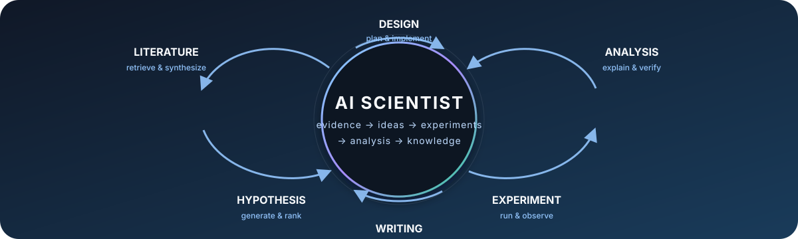

# 🧪 Awesome AI Scientist

**A curated, high-signal map of papers, systems, benchmarks, datasets, and tools for AI systems that conduct or accelerate scientific discovery.**

> Last curated: **2026-08-24** · The list favors technically substantive work with a paper or preprint and a direct research artifact where one is available.

## News & Updates

- **2026-08-24** — Initial release: core AI Scientist systems, co-scientists, research stages, domains, evaluation, and scientific environments.
- **Ongoing** — New entries are screened for scientific relevance, evidence of evaluation, and a link to the primary paper or project.

## Introduction

An **AI Scientist** is an AI system that uses foundation models, tools, code, data, and sometimes laboratory interfaces to execute or support one or more parts of the scientific discovery loop: literature review, hypothesis generation, experiment design, experimentation, analysis, and writing. This repository collects the strongest and most useful papers, open systems, benchmarks, datasets, and research environments for building and evaluating such systems.

This is intentionally **not** a general AI-for-Science catalog. The center of gravity is agentic scientific work: systems that reason over evidence, call tools, write or execute programs, interact with experiments, and produce research artifacts that a scientist can inspect and reproduce.

### Curation principles

- **High signal over volume.** Foundational papers, strong evaluations, public artifacts, and results with meaningful scientific or reproducibility evidence come first.
- **Primary links.** We link to the paper or preprint, the official code repository, and the official project page when available.
- **Clear taxonomy.** A project may appear in more than one section when it serves different research stages or domains.
- **Human-verifiable science.** Claims, citations, code, data, and experimental outcomes should remain inspectable; impressive prose alone is not enough.
- **Responsible use.** AI-generated code and lab instructions can be unsafe. Run agents in isolated environments and validate scientific claims with domain experts and primary sources.

The star marker indicates an editor's pick: especially influential, capable, or useful as a reference implementation.

## Contents

- [Surveys & Perspectives](#surveys--perspectives)
- [AI Scientist Systems](#ai-scientist-systems)
- [AI Co-Scientists / Research Agents](#ai-co-scientists--research-agents)
- [By Research Stage](#by-research-stage)
  - [Literature Review](#literature-review)
  - [Hypothesis Generation](#hypothesis-generation)
  - [Experiment Design](#experiment-design)
  - [Experimentation](#experimentation)
  - [Analysis](#analysis)
  - [Writing](#writing)
- [By Domain](#by-domain)
  - [General](#general)
  - [Machine Learning & Algorithms](#machine-learning--algorithms)
  - [Biology](#biology)
  - [Chemistry](#chemistry)
  - [Medicine](#medicine)
  - [Materials](#materials)
  - [Physics](#physics)
- [Benchmarks & Evaluation](#benchmarks--evaluation)
- [Datasets & Environments](#datasets--environments)
- [Related Resources](#related-resources)
- [Contributing](#contributing)
- [License](#license)

## Surveys & Perspectives

- [⭐️ **From AI for Science to Agentic Science: A Survey on Autonomous Scientific Discovery**](https://arxiv.org/abs/2508.14111) — A broad map of agentic scientific discovery systems, workflows, tools, and open challenges.
- [**Agentic AI for Scientific Discovery: A Survey of Progress, Challenges, and Future Directions**](https://arxiv.org/abs/2503.08979) — Survey of agents, scientific reasoning, tool use, and evaluation.
- [**From Automation to Autonomy: A Survey on Large Language Models in Scientific Discovery**](https://arxiv.org/abs/2505.13259) — Taxonomy covering the transition from task automation to autonomous discovery.
- [**Agent Systems for Academic Research Automation**](https://openreview.net/forum?id=iAfYyiCzev) — Survey of academic research agents, including literature, ideation, experimentation, and paper production systems.
- [**Exploring the role of large language models in the scientific method: from hypothesis to discovery**](https://doi.org/10.1038/s44387-025-00019-5) — Perspective on where language models fit in the scientific method and where human judgment remains essential.
- [**Automated Scientific Discovery: From Equation Discovery to Autonomous Discovery Systems**](https://link.springer.com/article/10.1007/s10994-025-06955-2) — Overview of the longer arc from symbolic equation discovery to autonomous systems.

## AI Scientist Systems

These are the closest matches to an end-to-end AI Scientist: they connect multiple research stages into a coherent loop. A system can still require human supervision or domain experts; “autonomous” is not treated as a binary claim.

- [⭐️ **OmniScientist — An Omni-Modal Omni-Discipline AI Scientist**](https://arxiv.org/abs/2608.13558) — An end-to-end system designed to reason over heterogeneous scientific evidence across modalities and disciplines.
  
  
  

- [⭐️ **The AI Scientist — Towards end-to-end automation of AI research**](https://www.nature.com/articles/s41586-026-10265-5) — A complete machine-learning research pipeline spanning idea generation, coding, experiment execution, analysis, paper writing, and review.
  
  
  
  

- [⭐️ **The AI Scientist-v2 — Workshop-Level Automated Scientific Discovery via Agentic Tree Search**](https://arxiv.org/abs/2504.08066) — Removes human-authored experiment templates and uses agentic tree search, experiment management, and visual feedback to explore research directions.
  
  
  

- [⭐️ **Robin — A multi-agent system for automating scientific discovery**](https://www.nature.com/articles/s41586-026-10652-y) — A multi-agent biological discovery system that connects hypothesis generation, experimental strategy, data analysis, and follow-up studies.
  
  
  

- [⭐️ **data-to-paper — Autonomous LLM-driven research from data to human-verifiable research papers**](https://doi.org/10.1056/AIoa2400555) — An auditable pipeline that turns a dataset into hypotheses, analyses, figures, and a paper while tracing quantitative claims back to executable code and data.
  
  
  

- [**Agent Laboratory — Using LLM Agents as Research Assistants**](https://arxiv.org/abs/2501.04227) — A human-in-the-loop research workflow for literature review, experimentation, and report generation from a scientist's research idea.
  
  
  

## AI Co-Scientists / Research Agents

These systems are highly relevant to AI Scientist research but focus on one or more parts of the loop, or explicitly position the human scientist as the primary decision maker.

- [⭐️ **Towards an AI co-scientist**](https://arxiv.org/abs/2502.18864) — A multi-agent system for generating, debating, ranking, and evolving research hypotheses and proposals against scientist-specified goals.
  
  

- [⭐️ **PaperQA2 — Language agents achieve superhuman synthesis of scientific knowledge**](https://arxiv.org/abs/2409.13740) — Evidence-grounded literature synthesis with retrieval, source attribution, and answer verification.
  
  
  

- [⭐️ **OpenScholar**](https://www.nature.com/articles/s41586-025-10072-4) — An open, retrieval-augmented research agent for citation-grounded scientific synthesis over a large scholarly corpus.
  
  
  
  

- [**ResearchAgent — Iterative Research Idea Generation over Scientific Literature with LLMs**](https://arxiv.org/abs/2404.07738) — Uses a literature graph, a knowledge store, and iterative review agents to propose research problems, methods, and experiments.
  

- [**Aviary — Training language agents on challenging scientific tasks**](https://arxiv.org/abs/2412.21154) — A family of scientific environments and agent infrastructure for tasks such as literature search, DNA cloning, and protein stability.
  
  
  

- [⭐️ **Biomni — A General-Purpose Biomedical AI Agent**](https://doi.org/10.1101/2025.05.30.656746) — A general biomedical agent with retrieval, planning, code execution, and access to a broad tool and database ecosystem.
  
  
  

- [⭐️ **Coscientist**](https://www.nature.com/articles/s41586-023-06792-0) — An LLM-powered laboratory agent that planned and executed chemistry experiments through web, documentation, code, and robotic-lab interfaces.
  
  

- [**ChemCrow**](https://doi.org/10.1038/s42256-024-00832-8) — A chemistry agent that combines an LLM with chemical tools for synthesis planning, property reasoning, and experimental workflows.
  
  
  
  

## By Research Stage

### Literature Review

- [⭐️ **OpenScholar**](https://www.nature.com/articles/s41586-025-10072-4) · [Code](https://github.com/AkariAsai/OpenScholar) · [Demo](https://open-scholar.allen.ai/) — Open retrieval and citation-grounded synthesis.
- [⭐️ **PaperQA2**](https://arxiv.org/abs/2409.13740) · [Code](https://github.com/Future-House/paper-qa) — Evidence-backed answers from scientific papers.
- [**STORM**](https://aclanthology.org/2024.naacl-long.347/) · [Code](https://github.com/stanford-oval/storm) · [Project](https://storm.genie.stanford.edu/) — Multi-perspective research and grounded long-form synthesis.
- [**ResearchAgent**](https://arxiv.org/abs/2404.07738) — Iterative literature-graph exploration for research ideation.

### Hypothesis Generation

- [⭐️ **Towards an AI co-scientist**](https://arxiv.org/abs/2502.18864) · [Google Research](https://research.google/blog/accelerating-scientific-breakthroughs-with-an-ai-co-scientist/) — Generate, debate, rank, and evolve hypotheses.
- [⭐️ **Robin**](https://www.nature.com/articles/s41586-026-10652-y) · [Code](https://github.com/Future-House/robin) — Multi-agent biological discovery and follow-up.
- [**MOOSE-Chem**](https://arxiv.org/abs/2410.07076) · [Code](https://github.com/ZonglinY/MOOSE-Chem) — Rediscovery of unseen chemistry hypotheses from literature.
- [**Sparks of Science**](https://arxiv.org/abs/2504.12976) · [HypoGen dataset](https://huggingface.co/datasets/UniverseTBD/hypogen-dr1) — Structured hypothesis generation from paper data.
- [**FunSearch**](https://www.nature.com/articles/s41586-023-06924-6) · [Code](https://github.com/google-deepmind/funsearch) — Program-search formulation of discovery in mathematical and algorithmic domains.

### Experiment Design

- [⭐️ **Coscientist**](https://www.nature.com/articles/s41586-023-06792-0) · [Code](https://github.com/gomesgroup/coscientist) — Plan and execute chemistry experiments through lab interfaces.
- [**ChemCrow**](https://doi.org/10.1038/s42256-024-00832-8) · [Code](https://github.com/ur-whitelab/chemcrow-public) — Tool-augmented chemistry planning.
- [⭐️ **The AI Scientist-v2**](https://arxiv.org/abs/2504.08066) · [Code](https://github.com/SakanaAI/AI-Scientist-v2) — Agentic search over experiment proposals and implementations.
- [**Biomni**](https://doi.org/10.1101/2025.05.30.656746) · [Code](https://github.com/snap-stanford/Biomni) — Biomedical planning with executable tool calls.

### Experimentation

- [⭐️ **The AI Scientist**](https://www.nature.com/articles/s41586-026-10265-5) · [Code](https://github.com/SakanaAI/AI-Scientist) — Automated ML coding, experiments, plots, and paper generation.
- [⭐️ **data-to-paper**](https://doi.org/10.1056/AIoa2400555) · [Code](https://github.com/Technion-Kishony-lab/data-to-paper) — Reproducible analysis from data to paper.
- [**Paper2Code**](https://arxiv.org/abs/2504.17192) · [Code](https://github.com/going-doer/Paper2Code) — Converts scientific ML papers into executable implementations.
- [**A-Lab**](https://www.nature.com/articles/s41586-023-06734-w) — Autonomous inorganic synthesis with robotics, computation, and active learning.

### Analysis

- [⭐️ **OmniScientist**](https://arxiv.org/abs/2608.13558) · [Code](https://github.com/Omni-Scientist/OmniScientist) — Multimodal evidence and scientific analysis across domains.
- [⭐️ **Robin**](https://www.nature.com/articles/s41586-026-10652-y) · [Code](https://github.com/Future-House/robin) — Multi-agent analysis feeding back into biological discovery.
- [**data-to-paper**](https://doi.org/10.1056/AIoa2400555) · [Code](https://github.com/Technion-Kishony-lab/data-to-paper) — Traceable figures, claims, code, and data.
- [**Biomni**](https://doi.org/10.1101/2025.05.30.656746) · [Code](https://github.com/snap-stanford/Biomni) — Tool-using analysis for biomedical questions.

### Writing

- [⭐️ **The AI Scientist-v2**](https://arxiv.org/abs/2504.08066) · [Code](https://github.com/SakanaAI/AI-Scientist-v2) — Research reports generated from an agentic experiment tree.
- [⭐️ **data-to-paper**](https://doi.org/10.1056/AIoa2400555) · [Code](https://github.com/Technion-Kishony-lab/data-to-paper) — Human-verifiable papers with backward traceability.
- [**STORM**](https://aclanthology.org/2024.naacl-long.347/) · [Code](https://github.com/stanford-oval/storm) — Structured, multi-perspective long-form research writing.
- [**Agent Laboratory**](https://arxiv.org/abs/2501.04227) · [Code](https://github.com/SamuelSchmidgall/AgentLaboratory) — Human-in-the-loop reports from a research workflow.

## By Domain

This section is intentionally narrower than a general AI-for-Science list. It highlights domain systems that contribute a meaningful discovery, experimentation, or research-agent capability.

### General

- [⭐️ **OmniScientist**](https://arxiv.org/abs/2608.13558) · [Code](https://github.com/Omni-Scientist/OmniScientist) · [Website](https://omni-scientist.github.io/)
- [⭐️ **The AI Scientist-v2**](https://arxiv.org/abs/2504.08066) · [Code](https://github.com/SakanaAI/AI-Scientist-v2)
- [⭐️ **Robin**](https://www.nature.com/articles/s41586-026-10652-y) · [Code](https://github.com/Future-House/robin)
- [**data-to-paper**](https://doi.org/10.1056/AIoa2400555) · [Code](https://github.com/Technion-Kishony-lab/data-to-paper)

### Machine Learning & Algorithms

- [⭐️ **The AI Scientist**](https://www.nature.com/articles/s41586-026-10265-5) · [Code](https://github.com/SakanaAI/AI-Scientist)
- [⭐️ **AlphaEvolve**](https://arxiv.org/abs/2506.13131) · [DeepMind](https://deepmind.google/blog/alphaevolve-a-gemini-powered-coding-agent-for-designing-advanced-algorithms/) · [Problem repository](https://google-deepmind.github.io/alphaevolve_repository_of_problems/)
- [⭐️ **FunSearch**](https://www.nature.com/articles/s41586-023-06924-6) · [Code](https://github.com/google-deepmind/funsearch)
- [**Paper2Code**](https://arxiv.org/abs/2504.17192) · [Code](https://github.com/going-doer/Paper2Code)
- [**MLE-bench**](https://arxiv.org/abs/2410.07095) · [Code](https://github.com/openai/mle-bench) — A useful execution-grounded ML engineering benchmark.

### Biology

- [⭐️ **Robin**](https://www.nature.com/articles/s41586-026-10652-y) · [Code](https://github.com/Future-House/robin)
- [⭐️ **Biomni**](https://doi.org/10.1101/2025.05.30.656746) · [Code](https://github.com/snap-stanford/Biomni) · [Website](https://biomni.stanford.edu/)
- [**Towards an AI co-scientist**](https://arxiv.org/abs/2502.18864) · [Google Research](https://research.google/blog/accelerating-scientific-breakthroughs-with-an-ai-co-scientist/)
- [**Aviary**](https://arxiv.org/abs/2412.21154) · [Environment](https://github.com/Future-House/aviary)

### Chemistry

- [⭐️ **Coscientist**](https://www.nature.com/articles/s41586-023-06792-0) · [Code](https://github.com/gomesgroup/coscientist)
- [⭐️ **ChemCrow**](https://doi.org/10.1038/s42256-024-00832-8) · [Code](https://github.com/ur-whitelab/chemcrow-public)
- [**MOOSE-Chem**](https://arxiv.org/abs/2410.07076) · [Code](https://github.com/ZonglinY/MOOSE-Chem)
- [**MOOSE-Chem2**](https://arxiv.org/abs/2505.19209) · [Code](https://github.com/ZonglinY/MOOSE-Chem2)

### Medicine

- [⭐️ **Towards an AI co-scientist**](https://arxiv.org/abs/2502.18864) · [Google Research](https://research.google/blog/accelerating-scientific-breakthroughs-with-an-ai-co-scientist/)
- [⭐️ **Robin**](https://www.nature.com/articles/s41586-026-10652-y) · [Code](https://github.com/Future-House/robin)
- [⭐️ **Biomni**](https://doi.org/10.1101/2025.05.30.656746) · [Code](https://github.com/snap-stanford/Biomni)
- [**PaperQA2**](https://arxiv.org/abs/2409.13740) · [Code](https://github.com/Future-House/paper-qa)

### Materials

- [⭐️ **A-Lab**](https://www.nature.com/articles/s41586-023-06734-w) — Autonomous inorganic synthesis using robotics, computation, and active learning.
- [⭐️ **GNoME**](https://www.nature.com/articles/s41586-023-06735-9) · [Code and data](https://github.com/google-deepmind/materials_discovery) — ML-guided discovery of stable inorganic materials.
- [⭐️ **MatterGen**](https://www.nature.com/articles/s41586-025-08628-5) · [Preprint](https://arxiv.org/abs/2312.03687) · [Code](https://github.com/microsoft/mattergen) — Generative materials design with property conditioning.
- [**Materials Project**](https://materialsproject.org/) — Open computational materials data and infrastructure used by many discovery workflows.

### Physics

- [⭐️ **AI Feynman**](https://arxiv.org/abs/1905.11481) · [Code](https://github.com/SJ001/AI-Feynman) — Symbolic regression for rediscovering compact physical laws.
- [**AI-Descartes**](https://www.nature.com/articles/s41467-023-37236-y) · [Code](https://github.com/IBM/AI-Descartes) — Automated scientific law discovery with symbolic and numerical reasoning.
- [**FunSearch**](https://www.nature.com/articles/s41586-023-06924-6) · [Code](https://github.com/google-deepmind/funsearch) — LLM-guided program search for mathematical discovery.

## Benchmarks & Evaluation

Evaluation is the bottleneck. The entries below test scientific knowledge, literature grounding, code and experiment execution, full research workflows, or interaction with scientific environments.

- [⭐️ **AstaBench**](https://arxiv.org/abs/2510.21652) · [Code](https://github.com/allenai/asta-bench) — A broad scientific research suite spanning literature, ideation, coding, analysis, and other research tasks.
- [⭐️ **ScienceBoard**](https://arxiv.org/abs/2505.19897) · [Code](https://github.com/OS-Copilot/ScienceBoard) · [Website](https://qiushisun.github.io/ScienceBoard-Home/) — Realistic multi-domain research tasks across GUI and CLI environments.
- [⭐️ **ScienceAgentBench**](https://arxiv.org/abs/2410.05080) · [Code](https://github.com/OSU-NLP-Group/ScienceAgentBench) · [Website](https://osu-nlp-group.github.io/ScienceAgentBench/) — Expert-authored scientific coding tasks grounded in peer-reviewed papers.
- [⭐️ **PaperBench**](https://arxiv.org/abs/2504.01848) · [Code](https://github.com/openai/preparedness/tree/main/project/paperbench) · [Project](https://openai.com/index/paperbench/) — Reproducing and extending published research from paper specifications, code, and execution.
- [⭐️ **CORE-Bench**](https://arxiv.org/abs/2409.11363) · [Code](https://github.com/siegelz/core-bench) · [Leaderboard](https://hal.cs.princeton.edu/corebench_hard) — Reproducibility tasks across computational social science, medicine, and related fields.
- [**SciCode**](https://arxiv.org/abs/2407.13168) · [Code](https://github.com/scicode-bench/SciCode) · [Website](https://scicode-bench.github.io/) — Scientist-curated scientific coding problems decomposed into executable subproblems.
- [**MLE-bench**](https://arxiv.org/abs/2410.07095) · [Code](https://github.com/openai/mle-bench) — Execution-based evaluation on real-world machine-learning engineering tasks.
- [**LAB-Bench**](https://arxiv.org/abs/2407.10362) · [Code](https://github.com/Future-House/LAB-Bench) · [Dataset](https://huggingface.co/datasets/futurehouse/lab-bench) — Biology research capabilities including protocols, sequence reasoning, and literature understanding.
- [**AIRS-Bench**](https://arxiv.org/abs/2602.06855) · [Code](https://github.com/facebookresearch/airs-bench) · [Dataset](https://huggingface.co/datasets/facebook/airs-bench) — Frontier ML research tasks covering a full research lifecycle without assuming baseline code.

## Datasets & Environments

These resources provide the corpora, tools, simulated worlds, or domain data that agents need. They are included for scientific-agent use cases, not as an exhaustive AI-for-Science dataset catalog.

### Agent environments and research corpora

- [**Aviary**](https://github.com/Future-House/aviary) — Open environments and infrastructure for scientific language agents.
- [**DiscoveryWorld**](https://arxiv.org/abs/2406.06769) · [Code](https://github.com/allenai/discoveryworld) — Interactive simulated scientific discovery tasks in text and 2D environments.
- [**ScienceWorld**](https://arxiv.org/abs/2203.07540) · [Code](https://github.com/allenai/ScienceWorld) — Interactive text-based science environment for embodied reasoning and experimentation.
- [**ScholarQABench**](https://github.com/AkariAsai/ScholarQABench) — Benchmark and data for scientific question answering over scholarly literature.
- [**HypoGen**](https://huggingface.co/datasets/UniverseTBD/hypogen-dr1) — Structured scientific hypothesis data released with Sparks of Science.
- [**S2ORC**](https://allenai.org/data/s2orc) — Large open scientific paper corpus for scholarly NLP and retrieval.
- [**OpenAlex**](https://openalex.org/) · [Documentation](https://docs.openalex.org/) — Open scholarly graph and API for works, authors, institutions, and concepts.

### Domain data and tools

- [**Materials Project**](https://materialsproject.org/) — Computed materials properties, structures, and discovery infrastructure.
- [**ChEMBL**](https://www.ebi.ac.uk/chembl/) — Curated bioactivity database for drug-discovery research.
- [**PubChem**](https://pubchem.ncbi.nlm.nih.gov/) — Open chemical information and compound database.
- [**ProteinGym**](https://proteingym.org/) — Protein fitness prediction datasets and evaluation resources.

## Related Resources

### Awesome lists and reading lists

- [**Awesome World Models**](https://github.com/knightnemo/Awesome-World-Models) — The design reference for this repository: concise entries, a strong navigation layer, update history, badges, and a clear contribution path.
- [**awesome-agents4science**](https://github.com/OSU-NLP-Group/awesome-agents4science) — Broader reading list for agents in scientific discovery.
- [**The Library of AI Scientist**](https://github.com/FengxianJi/The-Library-of-AI-Scientist) — Larger collection of AI Scientist papers, projects, and related resources.
- [**AI4Science curated reading list**](https://github.com/MI-Hussain/AI4Science) — Wider AI-for-Science papers and tools beyond autonomous research agents.

### Tutorials, blogs, and project pages

- [**Sakana AI — The AI Scientist**](https://sakana.ai/ai-scientist/) — Project overview and examples for the original AI Scientist.
- [**FutureHouse tutorial series**](https://future-house.github.io/tutorial-series/) — Practical material on building and using scientific agents.
- [**FutureHouse — Aviary**](https://www.futurehouse.org/research/aviary) — Research context for scientific agent environments.
- [**Google DeepMind — AlphaEvolve**](https://deepmind.google/blog/alphaevolve-a-gemini-powered-coding-agent-for-designing-advanced-algorithms/) — Algorithm discovery through an LLM-guided coding agent.
- [**Google Research — AI co-scientist**](https://research.google/blog/accelerating-scientific-breakthroughs-with-an-ai-co-scientist/) — Official overview of a multi-agent research partner.

## Contributing

We welcome focused additions, corrections, and better primary links. Please read [CONTRIBUTING.md](CONTRIBUTING.md) before opening a pull request.

### What belongs here?

An entry should make a meaningful contribution to AI-assisted or AI-driven scientific work. Strong candidates have at least one of the following:

- a peer-reviewed paper or technically substantive preprint;
- a public implementation, benchmark, dataset, environment, or reproducible artifact;
- an evaluation that measures scientific validity, reproducibility, tool use, or research productivity;
- a clear connection to literature review, hypothesis generation, experiment design, experimentation, analysis, or scientific writing.

Please prefer one excellent entry over several weak or duplicative ones. Generic chat interfaces, unsupported “AI Scientist” marketing claims, and papers with no scientific-agent relevance are usually out of scope.

## Citation

If this list is useful in your work, please cite or link to the repository:

~~~bibtex
@misc{awesome_ai_scientist,
  title        = {Awesome AI Scientist},
  year         = {2026},
  howpublished = {https://github.com/unikcc/AI-Scientist-Awesome},
  note         = {A curated list of AI systems, benchmarks, datasets, and tools for scientific discovery}
}
~~~

## License

This list is released under the [Creative Commons Attribution 4.0 International License](LICENSE). The linked papers, code, datasets, and websites remain under their respective licenses and copyrights.

## Acknowledgements

The information architecture and presentation take inspiration from [Awesome World Models](https://github.com/knightnemo/Awesome-World-Models). The selection here is independently curated for AI Scientist systems and scientific research agents.
